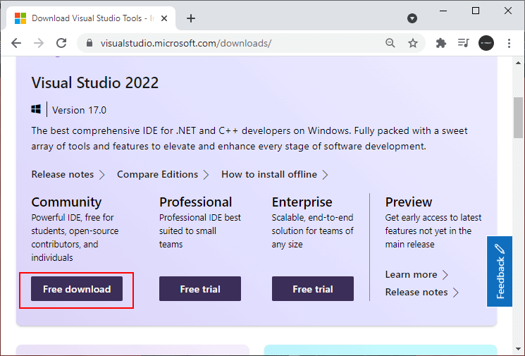
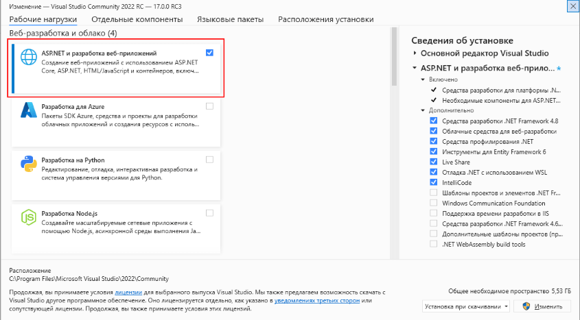
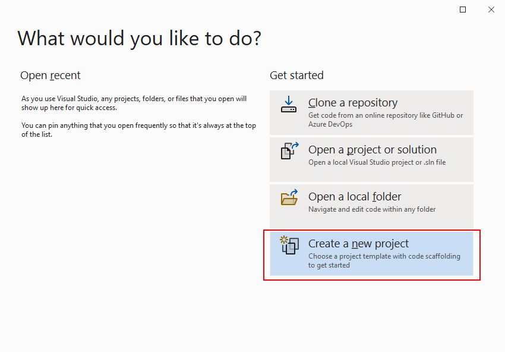
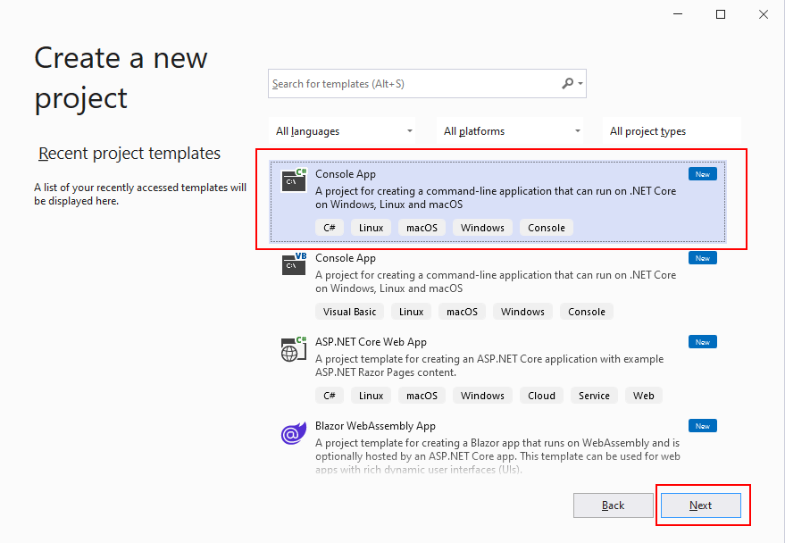
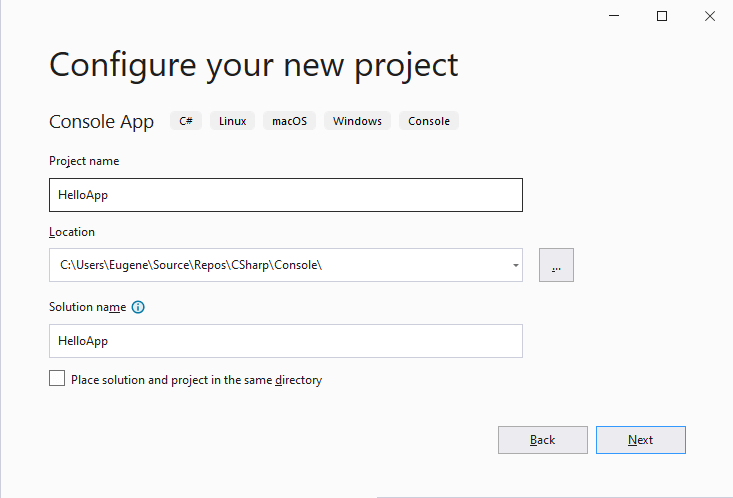
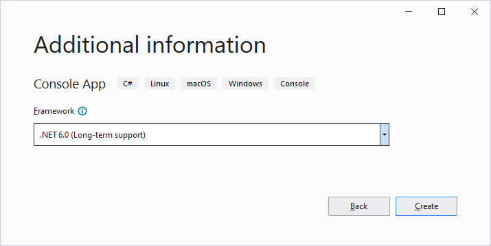
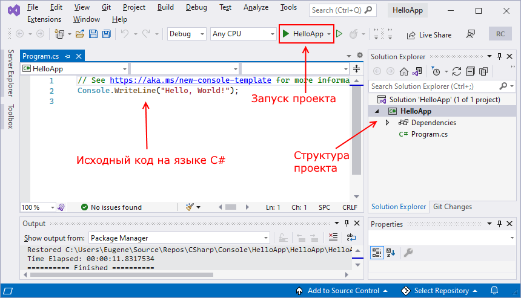
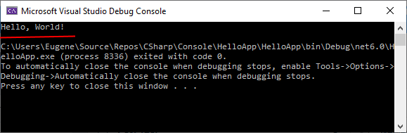
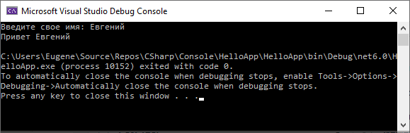

# Начало работы. Visual Studio

Итак, создадим первое приложение на языке C#. Что для этого потребуется? Во-первых, нам нужен текстовый редактор, в котором мы могли бы напечатать код программы. Во-вторых, нам нужен компилятор, который бы скомпилировал набранный в текстовом редакторе код в приложение exe. В-третьих, нам нужен фреймворк .NET, который требуется для компиляции и выполнения программы.

Чтобы облегчить написание, а также тестирование и отладку программного кода обычно используют специальные среды разработки, в частности, Visual Studio.

Для создания приложений на C# будем использовать бесплатную и полнофункциональную среду разработки - Visual Studio Community 2022, которую можно загрузить по следующему адресу: Microsoft Visual Studio 2022



Стоит отметить, что Visual Studio 2019 и все предыдущие версии Visual Studio не поддерживают .NET 6 и C# 10, необходима именно версия Visual Studio 2022.

После загрузки запустим программу установщика. В открывшемся окне нам будет предложено выбрать те компоненты, которые мы хотим установить вместе Visual Studio. Стоит отметить, что Visual Studio - очень функциональная среда разработки и позволяет разрабатывать приложения с помощью множества языков и платформ. В нашем случае нам будет интересовать прежде всего C# и .NET.

Чтобы добавить в Visual Studio поддержку проектов для C# и .NET 6, в программе установки среди рабочих нагрузок можно выбрать только пункт **ASP.NET и разработка веб-приложений**. Можно выбрать и больше опций или вообще все опции, однако стоит учитывать свободный размер на жестком диске - чем больше опций будет выбрано, соответственно тем больше места на диске будет занято.



И при инсталляции Visual Studio на ваш компьютер будут установлены все необходимые инструменты для разработки программ, в том числе фреймворк .NET 6.

После завершения установки создадим первую программу. Она будет простенькой. Вначале откроем Visual Studio. На стартовом экране выберем **Create a new project (Создать новый проект)**



На следующем окне в качестве типа проекта выберем Console App, то есть мы будем создавать консольное приложение на языке C#



Далее на следующем этапе нам будет предложено указать имя проекта и каталог, где будет располагаться проект.



В поле **Project Name** дадим проекту какое-либо название. В моем случае это **HelloApp**.

На следующем окне Visual Studio предложит нам выбрать версию .NET, которая будет использоваться для проекта. По умолчанию здесь выбрана последняя на данный момент версия - .NET 6.0. Оставим и нажмен на кнопку Create (Создать) для создания проекта.



После этого Visual Studio создаст и откроет нам проект:



В большом поле в центре, которое по сути представляет текстовый редактор, находится сгенерированный по умолчанию код C#. Впоследствии мы изменим его на свой.

Справа находится окно Solution Explorer, в котором можно увидеть структуру нашего проекта. В данном случае у нас сгенерированная по умолчанию структура: узел **Dependencies** - это узел содержит сборки dll, которые добавлены в проект по умолчанию. Эти сборки как раз содержат классы библиотеки .NET, которые будет использовать C#. Однако не всегда все сборки нужны. Ненужные потом можно удалить, в то же время если понадобится добавить какую-нибудь нужную библиотеку, то именно в этот узел она будет добавляться.

Далее идет непосредственно сам файл кода программы **Program.cs**, который по умолчанию открыт в центральном окне и который имеет всего две строки:

```Csharp

// See https://aka.ms/new-console-template for more information
Console.WriteLine("Hello, World!");

```


Первая строка предваряется символами // и представляет комментарии - пояснения к коду.

Вторая строка собственно представляет собой код программы: Console.WriteLine("Hello World!");. Эта строка выводит на консоль строку "Hello World!".

Несмотря на то, что программа содержит только одну строку кода, это уже некоторая программа, которую мы можем запустить. Запустить проект мы можем с помощью клавиши F5 или с панели инструментов, нажав на зеленую стрелку. И если вы все сделали правильно, то при запуске приложения на консоль будет выведена строка "Hello World!".



Теперь изменим весь этот код на следующий:

```Csharp

Console.Write("Введите свое имя: ");
string? name = Console.ReadLine();       // вводим имя
Console.WriteLine($"Привет {name}");    // выводим имя на консоль

```

По сравнению с автоматически сгенерированным кодом я внес несколько изменений. Теперь первой строкой выводится приглашение к вводу.

```Csharp
Console.Write("Введите свое имя: ");
```

Метод **Console.Write()** выводит на консоль некоторую строка. 
В данном случае это строка "Введите свое имя: ".

На второй строке определяется строковая переменная name, в которую пользователь вводит информацию с консоли:

```Csharp
string? name = Console.ReadLine();
```

Переменной name присваивается результат метода **Console.ReadLine()**, который позволяет считать с консоли введенную строку. То есть мы введем в консоли строку (точнее имя), и эта строка окажется в переменой name.

Выражение string? name указывает, что определяется переменная name типа string?, то есть переменная, которая может хранить строки. Здесь string указывает, что переменная может хранить значения типа string, то есть строки. А знак вопроса ? указывает, что переменная также может хранить значение **null**, то есть по сути не иметь никакого значения.

Затем введенное имя выводится на консоль:

```Csharp
Console.WriteLine($"Привет {name}");
```

Чтобы ввести значение переменной name внутрь выводимой на консоль строки, применяются фигурные скобки {}. То есть при выводе строки на консоль выражение {name} будет заменяться на значение переменной name - введенное имя.

Однако чтобы можно было вводить таким образом значения переменных внутрь строки, перед строкой указывается знак доллара $.

Теперь протестируем проект, запустив его на выполнение, также нажав на F5 или зеленую стрелочку.



Итак, мы создали первое приложение. Вы его можете найти на жестком диске в папке проекта в каталоге bin\Debug\net6.0. Оно будет называться по имени проекта и иметь расширение exe. И затем этот файл можно будет запускать без Visual Studio, а также переносить его на другие компьютеры, где установлен .NET 6.