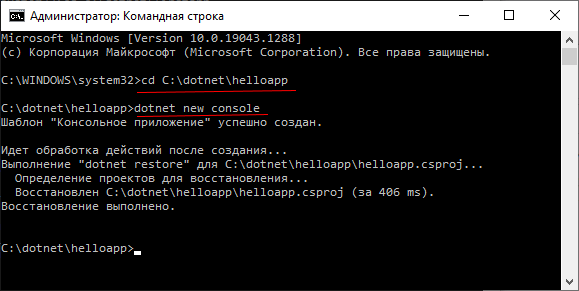
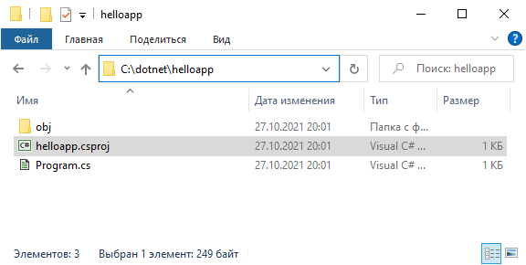

# Компиляция в командной строке с .NET CLI

Как правило, для создания программ на C# разработчики используют Visual Studio или какие-то другие IDE типа Rider от компании JetBrains. Но все подобные IDE, хотя и облегчают разработку, в то же время скрывают множество мельчайших подробностей по созданию программ. И в реальности мы даже можем обойтись без той же Visual Studio, используя только инфраструктуру .NET CLI. Рассмотрим, как использовать .NET CLI и компилировать приложение из командной строки.

Поэтому создадим на диске C какую-нибудь новую папку для проекта. Например, пусть мы создали для проекта папку C:\dotnet\helloapp. Откроем командную строку и с помощью команды cd перейдем к этой папке.

```
C:\WINDOWS\system32>cd C:\dotnet\helloapp
```

Для создания проекта в .NET CLI применяется команда ```dotnet new```, которой передается название проекта. Итак, в введем в командной строке следующую команду:

```
C:\dotnet\helloapp>dotnet new console
```

В данном случае мы указываем, что создаваемый проект будет представлять консольное приложение.

<p align="center">
    
</p>


После выполнения этой команды в папке helloapp будет создан проект с минимальным набором стандартных файлов и папок.




В частности, мы можем найти в папке проекта файл ```helloapp.csproj```. Это главный файл проекта, который определяет его конфигурацию. Мы можем открыть его в любом текстовом редакторе, просмотреть и при необходимости изменить.

И, кроме того, по умолчанию создается главный файл программы ```Program.cs``` со следующим содержимым:


```Csharp
// See https://aka.ms/new-console-template for more information
Console.WriteLine("Hello, World!");
```

Соответственно, если нам надо внести изменения в исходный код программы, то мы будем изменять содержимое именно этого файла.

В принципе этот минимальный проект уже можно запускать. Для запуска проекта введем в командной строке следующую команду:

```
dotnet run
```

После выполнения команды в проекте в папке ```bin\MCD\Debug\net6.0``` появится файл программы ```helloapp.exe```, который можно вручную запустить на компьютере, где установлен .NET 6.