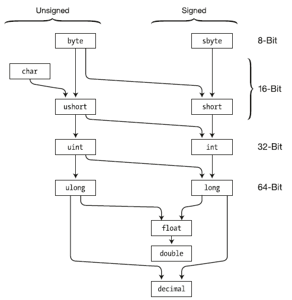

# Структура программы

## Выполнение программы

Весь код программы на языке C# помещается в файлы с расширением .cs. По умолчанию в проекте, который создается в Visual Studio (а также при использовании .NET CLI) уже есть один файл с кодом C# - файл ```Program.cs``` со следующим содержимым:

```Csharp
// See https://aka.ms/new-console-template for more information
Console.WriteLine("Hello, World!");
```

<p align ="center">


</p>

Именно код файла **Program.cs** выполняется по умолчанию, если мы запустим проект на выполнение. Но при необходимости мы также можем добавлять другие файлы с кодом C#.

## Инструкции

Базовым строительным блоком программы являются инструкции (statement). Инструкция представляет некоторое действие, например, арифметическую операцию, вызов метода, объявление переменной и присвоение ей значения. В конце каждой инструкции в C# ставится точка с запятой (;). Данный знак указывает компилятору на конец инструкции. Например, в проекте консольного приложения, который создается по умолчанию, есть такая строка:

```Csharp
Console.WriteLine("Hello, World!");
```

Данная строка представляет вызов метода ```Console.WriteLine```, который выводит на консоль строку. В данном случае вызов метода является инструкцией и поэтому завершается точкой с запятой.

Набор инструкций может объединяться в блок кода. Блок кода заключается в фигурные скобки, а инструкции помещаются между открывающей и закрывающей фигурными скобками. Например, изменим код файла **Program.cs** на следующий:

```Csharp
{
    Console.WriteLine("Привет");
    Console.WriteLine("Добро пожаловать в C#");
}
```

<p align ="center">


</p>


Здесь блок кода содержит две инструкции. И при выполении этого кода, консоль выведет две строки


```
Привет
Добро пожаловать в C#
```

В данном блоке кода две инструкции, которые выводят на консоль определенную строку.

Одни блоки кода могут содержать другие блоки:

```Csharp
{
    Console.WriteLine("Первый блок");
    {
        Console.WriteLine("Второй блок");
    }
}
```

## Регистрозависимость

C# является регистрозависимым языком. Это значит, что в зависимости от регистра символов какие-то определенные названия могут представлять разные классы, методы, переменные и т.д. Например, для вывода на консоль используется метод ```WriteLine``` - его имя начинается именно с большой буквы: "WriteLine". Если мы вместо "Console.WriteLine" напишем "Console.writeline", то программа не скомпилируется, так как данный метод обязательно должен называться "WriteLine", а не "writeline" или "WRITELINE" или как-то иначе.

## Комментарии

Важной частью программного кода являются комментарии. Они не являются собственно частью программы, при компиляции они игнорируются. Тем не менее комментарии делают код программы более понятным, помогая понять те или иные его части.

Есть два типа комментариев: однострочный и многострочный. Однострочный комментарий размещается на одной строке после двойного слеша //. А многострочный комментарий заключается между символами /* текст комментария */. Он может размещаться на нескольких строках. Например:


```Csharp
/*
       первая программа на C#,
       которая выводит приветствие на консоль
*/
Console.WriteLine("Привет");                // Выводим строку "Привет"
Console.WriteLine("Добро пожаловать в C#"); // Выводим строку "Добро пожаловать в C#"
```

## Файл проекта

В каждом проекте проекте C# есть файл, который отвечает за общую конфгурацию проекта. По умолчанию этот файл называется **Название_проекта.csproj**. Итак, откроем данный файл. Для этого либо двойным кликом левой кнопкой мыши нажмем на название проекта, либо нажмем на название проекта правой кнопкой мыши и в появившемся меню выберем пункт **Edit Project File**

<p align ="center">

 

</p>

После этого Visual Studio откроет нам файл проекта, который будет выглядеть следующим образом:


```xml
<Project Sdk="Microsoft.NET.Sdk">
 
  <PropertyGroup>
    <OutputType>Exe</OutputType>
    <TargetFramework>net6.0</TargetFramework>
    <ImplicitUsings>enable</ImplicitUsings>
    <Nullable>enable</Nullable>
  </PropertyGroup>
 
</Project>
```

Этот файл в виде кода xml определяет конфгурацию проекта и он может содержать множество элементов. Остановлюсь только на двух основных:

- **OutputType**: определяет выходной тип проекта. Это может быть выполняемое приложение в виде файла с расширением exe, которое запускается по нажатию. И также это может быть файл с расширением .dll - некоторый набор функциональностей, который используется другими проектами. По умолчанию здесь установлено значение "Exe", что значит, что мы создаем исполняемое приложение.
- **TargetFramework**: определяет применяемую для компиляции версию фреймворка .NET. В данном случае это значение "net6.0", то есть применяется .NET 6.0.

На самых ранних этапах этот файл может не понадобиться, однако впоследствии может потребоваться внести некоторые изменения в конфигурацию, и тогда может возникнуть потребность в обращении к этому файлу.


## Переменные и константы

Для хранения данных в программе применяются переменные. Переменная представляет именнованную область памяти, в которой хранится значение определенного типа. Переменная имеет тип, имя и значение. Тип определяет, какого рода информацию может хранить переменная.

Перед использованием любую переменную надо определить. Синтаксис определения переменной выглядит следующим образом:

```
тип имя_переменной;
```

Вначале идет тип переменной, потом ее имя. В качестве имени переменной может выступать любое произвольное название, которое удовлетворяет следующим требованиям:

- имя может содержать любые цифры, буквы и символ подчеркивания, при этом первый символ в имени должен быть буквой или символом подчеркивания
- в имени не должно быть знаков пунктуации и пробелов
- имя не может быть ключевым словом языка C#. Таких слов не так много, и при работе в Visual Studio среда разработки подсвечивает ключевые слова синим цветом.

Хотя имя переменой может быть любым, но следует давать переменным описательные имена, которые будут говорить об их предназначении.

Например, определим простейшую переменную:

```
string name;
```

В данном случае определена переменная name, которая имеет тип **string**. то есть переменная представляет строку. Поскольку определение переменной представляет собой инструкцию, то после него ставится точка с запятой.

При этом следует учитывать, что C# является регистрозависимым языком, поэтому следующие два определения переменных будут представлять две разные переменные:

```
string name;
string Name;
```

После определения переменной можно присвоить некоторое значение:

```
string name;
name = "Tom";
```

Так как переменная name представляет тип string, то есть строку, то мы можем присвоить ей строку в двойных кавычках. Причем переменной можно присвоить только то значение, которое соответствует ее типу.

В дальнейшем с помощью имени переменной мы сможем обращаться к той области памяти, в которой хранится ее значение.

Также мы можем сразу при определении присвоить переменной значение. Данный прием называется инициализацией:

```
string name = "Tom";
```


Отличительной чертой переменных является то, что в программе можно многократно менять их значение. Например, создадим небольшую программу, в которой определим переменную, поменяем ее значение и выведем его на консоль:

```
string name = "Tom";  // определяем переменную и инициализируем ее
  
Console.WriteLine(name);    // Tom
  
name = "Bob";       // меняем значение переменной
Console.WriteLine(name);    // Bob
```

Консольный вывод программы:

```
Tom
Bob
```


## Константы

Отличительной особенностью переменных является то, что мы можем изменить их значение в процессе работы программы. Но, кроме того, в C# есть константы. **Константа** должна быть обязательно инициализирована при определении, и после определения значение константы не может быть изменено

Константы предназначены для описания таких значений, которые не должны изменяться в программе. Для определения констант используется ключевое слово const, которое указывается перед типом константы:

```
const string NAME = "Tom";  // определяем константу
```

Так, в данном случае определена константа NAME, которая хранит строку "Tom". Нередко для название констант используется верхний регистр, но это не более чем условность.

При использовании констант надо помнить, что объявить мы их можем только один раз и что к моменту компиляции они должны быть определены. Так, в следующем случае мы получим ошибку, так как константе не присвоено начальное значение:


```
const string NAME;  // ! Ошибка - константа NAME не инициализирована
```

Кроме того, мы ее не сможем изменим в процессе работы программы:

```
const string NAME = "Tom";  // определяем константу
NAME = "Bob";   // !Ошибка - у констаты нельзя изменить значение
```

Таким образом, если нам надо хранить в программе некоторые данные, но их не следует изменить, они определяются в виде констант. Если же их можно изменять, то они определяются в виде переменных.

## Литералы

Литералы представляют неизменяемые значения (иногда их еще называют константами). Литералы можно передавать переменным в качестве значения. Литералы бывают логическими, целочисленными, вещественными, символьными и строчными. И отдельный литерал представляет ключевое слово null.

## Логические литералы

Есть две логических константы - true (истина) и false (ложь):


```Csharp
Console.WriteLine(true);
Console.WriteLine(false);
```

## Целочисленные литералы

Целочисленные литералы представляют положительные и отрицательные целые числа, например, 1, 2, 3, 4, -7, -109. Целочисленные литералы могут быть выражены в десятичной, шестнадцатеричной и двоичной форме.

С целыми числами в десятичной форме все должно быть понятно, так как они используются в повседневной жизни:

```Csharp
Console.WriteLine(-11);
Console.WriteLine(5);
Console.WriteLine(505);
```

Числа в двоичной форме предваряются символами 0b, после которых идет набор из нулей и единиц:

```Csharp
Console.WriteLine(0b11);        // 3
Console.WriteLine(0b1011);      // 11
Console.WriteLine(0b100001);    // 33
```

Для записи числа в шестнадцатеричной форме применяются символы 0x, после которых идет набор символов от 0 до 9 и от A до F, которые собственно представляют число:

```Csharp
Console.WriteLine(0x0A);    // 10
Console.WriteLine(0xFF);    // 255
Console.WriteLine(0xA1);    // 161
```

## Вещественные литералы

Вещественные литералы представляют дробные числа. Этот тип литералов имеет две формы. Первая форма - вещественные числа с фиксированной запятой, при которой дробную часть отделяется от целой части точкой. Например:

```
3.14
100.001
-0.38
```

Также вещественные литералы могут определяться в экспоненциальной форме MEp, где M — мантисса, E - экспонента, которая фактически означает "*10^" (умножить на десять в степени), а p — порядок. Например:

```Csharp
Console.WriteLine(3.2e3);   // по сути равно 3.2 * 10<sup>3</sup> = 3200
Console.WriteLine(1.2E-1);  // равно 1.2 * 10<sup>-1</sup> = 0.12
```

## Символьные литералы

Символьные литералы представляют одиночные символы. Символы заключаются в одинарные кавычки.

Символьные литералы бывают нескольких видов. Прежде всего это обычные символы:

```
'2'
'A'
'T'
```

Также мы можем передать их вывести на консоль с помощью Console.WriteLine:

```Csharp
Console.WriteLine('2');
Console.WriteLine('A');
Console.WriteLine('T');
```

Специальную группу представляют **управляющие последовательности**. Управляющая последовательность представляет символ, перед которым ставится слеш. И данная последовательность интерпретируется определенным образом. Наиболее часто используемые последовательности:

- "\n" - перевод строки
- "\t" - табуляция
- '\\' - слеш

И если компилятор встретит в тексте последовательность \t, то он будет воспринимать эту последовательность не как слеш и букву t, а как табуляцию - то есть длинный отступ.

Также символы могут определяться в виде шестнадцатеричных кодов, также заключенный в одинарные кавычки.

Еще один способ определения символов представляет использования шестнадцатеричных кодов ASCII. Для этого в одинарных кавычках указываются символы '\x', после которых идет шестнадцатеричный код символа из таблицы ASCII.

Например, литерал '\x78' представляет символ "x":

```Csharp
Console.WriteLine('\x78');    // x
Console.WriteLine('\x5A');    // Z
```

И последний способ определения символьных литералов представляет применение кодов из таблицы символов Unicode. Для этого в одинарных кавычках указываются символы '\u', после которых идет шестнадцатеричный код Unicode. Например, код '\u0411' представляет кириллический символ 'Б':

```Csharp
Console.WriteLine('\u0420');    // Р
Console.WriteLine('\u0421');    // С
```

## Строковые литералы

Строковые литералы представляют строки. Строки заключаются в двойные кавычки:

```Csharp
Console.WriteLine("hello");
Console.WriteLine("фыва");
Console.WriteLine("hello word");
```

Если внутри строки необходимо вывести двойную кавычку, то такая внутренняя кавычка предваряется обратным слешем:

```Csharp
Console.WriteLine("Компания \"Рога и копыта\"");
```

Также в строках можно использовать управляющие последовательности. Например, последовательность '\n' осуществляет перевод на новую строку:

```Csharp
Console.WriteLine("Привет \nмир");
```

При выводе на консоль слово "мир" будет перенесено на новую строку:

```
Привет
мир
```

## null

**null** представляет ссылку, которая не указывает ни на какой объект. То есть по сути отсутствие значения.

## Типы данных

Как и во многих языках программирования, в C# есть своя система типов данных, которая используется для создания переменных. Тип данных определяет внутреннее представление данных, множество значений, которые может принимать объект, а также допустимые действия, которые можно применять над объектом.

В языке C# есть следующие базовые типы данных:

- bool: хранит значение true или false (логические литералы). Представлен системным типом System.Boolean

```Csharp
bool alive = true;
bool isDead = false;
```

- byte: хранит целое число от 0 до 255 и занимает 1 байт. Представлен системным типом System.Byte


```Csharp
byte bit1 = 1;
byte bit2 = 102;
```


- sbyte: хранит целое число от -128 до 127 и занимает 1 байт. Представлен системным типом System.SByte

```Csharp
sbyte bit1 = -101;
sbyte bit2 = 102;
```

- short: хранит целое число от -32768 до 32767 и занимает 2 байта. Представлен системным типом System.Int16

```Csharp
short n1 = 1;
short n2 = 102;
```

- ushort: хранит целое число от 0 до 65535 и занимает 2 байта. Представлен системным типом System.UInt16
  
```Csharp
ushort n1 = 1;
ushort n2 = 102;
```

- int: хранит целое число от -2147483648 до 2147483647 и занимает 4 байта. Представлен системным типом System.Int32. Все целочисленные литералы по умолчанию представляют значения типа int:

```Csharp
int a = 10;
int b = 0b101;  // бинарная форма b =5
int c = 0xFF;   // шестнадцатеричная форма c = 255
```

- uint: хранит целое число от 0 до 4294967295 и занимает 4 байта. Представлен системным типом System.UInt32


```Csharp
uint a = 10;
uint b = 0b101;
uint c = 0xFF;
```

- long: хранит целое число от –9 223 372 036 854 775 808 до 9 223 372 036 854 775 807 и занимает 8 байт. Представлен системным типом System.Int64

```Csharp
long a = -10;
long b = 0b101;
long c = 0xFF;
```

- ulong: хранит целое число от 0 до 18 446 744 073 709 551 615 и занимает 8 байт. Представлен системным типом System.UInt64

```Csharp
ulong a = 10;
ulong b = 0b101;
ulong c = 0xFF;
```

- float: хранит число с плавающей точкой от -3.4*1038 до 3.4*1038 и занимает 4 байта. Представлен системным типом System.Single

- double: хранит число с плавающей точкой от ±5.0*10-324 до ±1.7*10308 и занимает 8 байта. Представлен системным типом System.Double

- decimal: хранит десятичное дробное число. Если употребляется без десятичной запятой, имеет значение от ±1.0*10-28 до ±7.9228*1028, может хранить 28 знаков после запятой и занимает 16 байт. Представлен системным типом System.Decimal

- char: хранит одиночный символ в кодировке Unicode и занимает 2 байта. Представлен системным типом System.Char. Этому типу соответствуют символьные литералы:

```Csharp
char a = 'A';
char b = '\x5A';
char c = '\u0420';
```

- string: хранит набор символов Unicode. Представлен системным типом System.String. Этому типу соответствуют строковые литералы.

```Csharp
string hello = "Hello";
string word = "world";
```

- object: может хранить значение любого типа данных и занимает 4 байта на 32-разрядной платформе и 8 байт на 64-разрядной платформе. Представлен системным типом System.Object, который является базовым для всех других типов и классов .NET.


```Csharp
object a = 22;
object b = 3.14;
object c = "hello code";
```

Например, определим несколько переменных разных типов и выведем их значения на консоль:

```Csharp
string name = "Tom";
int age = 33;
bool isEmployed = false;
double weight = 78.65;
 
Console.WriteLine($"Имя: {name}");
Console.WriteLine($"Возраст: {age}");
Console.WriteLine($"Вес: {weight}");
Console.WriteLine($"Работает: {isEmployed}");
```

Для вывода данных на консоль здесь применяется интерполяция: перед строкой ставится знак $ и после этого мы можем вводить в строку в фигурных скобках значения переменных. Консольный вывод программы:

```
Имя: Tom
Возраст: 33
Вес: 78,65
Работает: False
```

## Использование суффиксов

При присвоении значений надо иметь в виду следующую тонкость: все вещественные литералы (дробные числа) рассматриваются как значения типа **double**. И чтобы указать, что дробное число представляет тип **float** или тип **decimal**, необходимо к литералу добавлять суффикс: F/f - для float и M/m - для decimal.

```Csharp
float a = 3.14F;
float b = 30.6f;
 
decimal c = 1005.8M;
decimal d = 334.8m;
```

Подобным образом все целочисленные литералы рассматриваются как значения типа **int**. Чтобы явным образом указать, что целочисленный литерал представляет значение типа uint, надо использовать суффикс **U/u**, для типа **long** - суффикс **L/l**, а для типа **ulong** - суффикс **UL/ul**:

```Csharp
uint a = 10U;
long b = 20L;
ulong c = 30UL;
```

## Использование системных типов

Выше при перечислении всех базовых типов данных для каждого упоминался системный тип. Потому что название встроенного типа по сути представляет собой сокращенное обозначение системного типа. Например, следующие переменные будут эквивалентны по типу:

```Csharp
int a = 4;
System.Int32 b = 4;
```

## Неявная типизация

Ранее мы явным образом указывали тип переменных, например, int x;. И компилятор при запуске уже знал, что x хранит целочисленное значение.

Однако мы можем использовать и модель неявной типизации:

```Csharp
var hello = "Hell to World";
var c = 20;
```

Для неявной типизации вместо названия типа данных используется ключевое слово var. Затем уже при компиляции компилятор сам выводит тип данных исходя из присвоенного значения. Так как по умолчанию все целочисленные значения рассматриваются как значения типа int, то поэтому в итоге переменная c будет иметь тип int. Аналогично переменной hello присваивается строка, поэтому эта переменная будет иметь тип string

Эти переменные подобны обычным, однако они имеют некоторые ограничения.

Во-первых, мы не можем сначала объявить неявно типизируемую переменную, а затем инициализировать:

```Csharp
// этот код работает
int a;
a = 20;
 
// этот код не работает
var c;
c= 20;
```

Во-вторых, мы не можем указать в качестве значения неявно типизируемой переменной null:

```Csharp
// этот код не работает
var c=null;
```

Так как значение null, то компилятор не сможет вывести тип данных.


# Консольный ввод-вывод

## Консольный вывод

Для вывода информации на консоль мы уже использовали встроенный метод **Console.WriteLine**. То есть, если мы хотим вывести некоторую информацию на консоль, то нам надо передать ее в метод Console.WriteLine:

```Csharp
string hello = "Привет мир";
Console.WriteLine(hello);
Console.WriteLine("Добро пожаловать в C#!");
Console.WriteLine("Пока мир...");
Console.WriteLine(24.5);
```

Консольный вывод:

```
Привет мир!
Добро пожаловать в C#!
Пока мир...
24,5
```

Нередко возникает необходимость вывести на консоль в одной строке значения сразу нескольких переменных. В этом случае мы можем использовать прием, который называется интерполяцией:

```Csharp
string name = "Tom";
int age = 34;
double height = 1.7;
Console.WriteLine($"Имя: {name}  Возраст: {age}  Рост: {height}м");
```

Для встраивания отдельных значений в выводимую на консоль строку используются фигурные скобки, в которые заключается встраиваемое значение. Это можем значение переменной ({name}) или более сложное выражение (например, операция сложения {4 + 7}). А перед всей строкой ставится знак доллара $.

При выводе на консоль вместо помещенных в фигурные скобки выражений будут выводиться их значения:

```Имя: Tom  Возраст: 34  Рост: 1,7м```

Есть другой способ вывода на консоль сразу нескольких значений:

```Csharp
string name = "Tom";
int age = 34;
double height = 1.7;
Console.WriteLine("Имя: {0}  Возраст: {2}  Рост: {1}м", name, height, age);
```

Здесь мы видим, что строка в Console.WriteLine содержит некие числа в фигурных скобках: {0}, {1}, {2}. Это плейсхолдеры, вместо которых при выводе строки на консоль будут подставляться некоторые значения. Подставляемые значения указываются после строки через запятую.

При этом важен порядок подобных плейсхолдеров. Например, в данном случае после строки первой указана переменная name, потом height и потом age. Поэтому значение переменной name будет всавляться вместо первого плейсхолдера - {0} (нумерация начинается с нуля), height - вместо {1}, а age - вместо {2}. Поэтому в итоге пи выводе на консоль строка

```"Имя: {0}  Возраст: {2}  Рост: {1}м"```

будет заменена на

```"Имя: Tom  Возраст: 34  Рост: 1,7м"```


## Console.Write

Кроме Console.WriteLine() можно также использовать метод **Console.Write()**, он работает точно так же за тем исключением, что не добавляет переход на следующую строку, то есть последующий консольный вывод будет выводиться на той же строке.

```Csharp
string name = "Tom";
int age = 34;
double height = 1.7;
Console.Write($"Имя: {name}  Возраст: {age}  Рост: {height}м");
```

## Консольный ввод

Кроме вывода информации на консоль мы можем получать информацию с консоли. Для этого предназначен метод **Console.ReadLine()**. Он позволяет получить введенную строку.

```Csharp
Console.Write("Введите свое имя: ");
string? name = Console.ReadLine();
Console.WriteLine($"Привет {name}");
```

В данном случае все, что вводит пользователь, с помощью метода Console.ReadLine() передается в переменную name.

Пример работы программы:

```
Введите свое имя: Том
Привет Том
```

Особенностью метода Console.ReadLine() является то, что он может считать информацию с консоли только в виде строки. Кроме того, возможная ситуация, когда для метода Console.ReadLine не окажется доступных для считывания строк, то есть когда ему нечего считывать, он возвращаает значение **null**, то есть, грубо говоря, фактически отсутствие значения. И чтобы отразить эту ситуацию мы определяем переменную name, в которую получаем ввод с консоли, как переменную типа **string?**. Здесь string указывает, что переменная может хранить значения типа string, то есть строки. А знак вопроса ? указывает, что переменная также может хранить значение null, то есть по сути не иметь никакого значения. Далее мы более подробно разберем **null** и как с ним работать.

Однако, может возникнуть вопрос, как нам быть, если, допустим, мы хотим ввести возраст в переменную типа int или другую информацию в переменные типа double или decimal? По умолчанию платформа .NET предоставляет ряд методов, которые позволяют преобразовать различные значения к типам int, double и т.д. Некоторые из этих методов:

- **Convert.ToInt32()** (преобразует к типу int)
- **Convert.ToDouble()** (преобразует к типу double)
- **Convert.ToDecimal()** (преобразует к типу decimal)

Пример ввода значений:

```Csharp
Console.Write("Введите имя: ");
string? name = Console.ReadLine();
 
Console.Write("Введите возраст: ");
int age = Convert.ToInt32(Console.ReadLine());
 
Console.Write("Введите рост: ");
double height = Convert.ToDouble(Console.ReadLine());
 
Console.Write("Введите размер зарплаты: ");
decimal salary = Convert.ToDecimal(Console.ReadLine());
 
Console.WriteLine($"Имя: {name}  Возраст: {age}  Рост: {height}м  Зарплата: {salary}$");
```

При вводе важно учитывать текущую операционную систему. В одних культурах разделителем между целой и дробной частью является точка (США, Великобритания...), в других - запятая (Россия, Германия...). Например, если текущая ОС - русскоязычная, значит, надо вводить дробные числа с разделителем запятой. Если локализация англоязычная, значит, разделителем целой и дробной части при вводе будет точка.

Пример работы программы:

```
Введите имя: Том
Введите возраст: 25
Введите рост: 1,75
Введите размер зарплаты: 300,67
Имя: Том  Возраст: 25  Рост: 1,75м  Зарплата: 300,67$
```

# Арифметические операции языка C#

В C# используется большинство операций, которые применяются и в других языках программирования. Операции представляют определенные действия над операндами - участниками операции. В качестве операнда может выступать переменной или какое-либо значение (например, число). Операции бывают унарными (выполняются над одним операндом), бинарными - над двумя операндами и тернарными - выполняются над тремя операндами. Рассмотрим все виды операций.


Бинарные арифметические операции:

- **+**
  Операция сложения двух чисел:

```Csharp
    int x = 10;
    int z = x + 12; // 22
```

- **-**
  Операция вычитания двух чисел:

```Csharp
int x = 10;
int z = x - 6; // 4
```

- **\***
  Операция умножения двух чисел:

```Csharp
int x = 10;
int z = x * 5; // 50
```

- /
  операция деления двух чисел:

  ```Csharp
    int x = 10;
    int z = x / 5; // 2
    
    double a = 10;
    double b = 3;
    double c = a / b; // 3.33333333
  ```

  При делении стоит учитывать, что если оба операнда представляют целые числа, то результат также будет округляться до целого числа:

  ```Csharp
    double z = 10 /  4; //результат равен 2
  ```

    Несмотря на то, что результат операции в итоге помещается в переменную типа double, которая позволяет сохранить дробную часть, но в самой операции участвуют два литерала, которые по умолчанию рассматриваются как объекты int, то есть целые числа, и результат то же будет целочисленный.

    Для выхода из этой ситуации необходимо определять литералы или переменные, участвующие в операции, именно как типы double или float:

```Csharp
    double z = 10.0 /  4.0; //результат равен 2.5
```

- %
  Операция получение остатка от целочисленного деления двух чисел:

    ```Csharp
    double x = 10.0;
    double z = x % 4.0; //результат равен 2
    ```
Также есть ряд унарных операций, в которых принимает участие один операнд:

- ++
  Операция инкремента

  Инкремент бывает префиксным: ++x - сначала значение переменной x увеличивается на 1, а потом ее значение возвращается в качестве результата операции.

  И также существует постфиксный инкремент: x++ - сначала значение переменной x возвращается в качестве результата операции, а затем к нему прибавляется 1.


```Csharp
int x1 = 5;
int z1 = ++x1; // z1=6; x1=6
Console.WriteLine($"{x1} - {z1}");
 
int x2 = 5;
int z2 = x2++; // z2=5; x2=6
Console.WriteLine($"{x2} - {z2}");
```

- --
  Операция декремента или уменьшения значения на единицу. Также существует префиксная форма декремента (--x) и постфиксная (x--).
  ```Csharp
    int x1 = 5;
    int z1 = --x1; // z1=4; x1=4
    Console.WriteLine($"{x1} - {z1}");
    
    int x2 = 5;
    int z2 = x2--; // z2=5; x2=4
    Console.WriteLine($"{x2} - {z2}");
  ```

При выполнении сразу нескольких арифметических операций следует учитывать порядок их выполнения. Приоритет операций от наивысшего к низшему:

1. Инкремент, декремент
2. Умножение, деление, получение остатка
3. Сложение, вычитание

Для изменения порядка следования операций применяются скобки.

Рассмотрим набор операций:

```Csharp
int a = 3;
int b = 5;
int c = 40;
int d = c---b*a;    // a=3  b=5  c=39  d=25
Console.WriteLine($"a={a}  b={b}  c={c}  d={d}");
```

Здесь мы имеем дело с тремя операциями: декремент, вычитание и умножение. Сначала выполняется декремент переменной c, затем умножение b*a, и в конце вычитание. То есть фактически набор операций выглядел так:

```Csharp
int d = (c--)-(b*a);
```

Но с помощью скобок мы могли бы изменить порядок операций, например, следующим образом:

```Csharp
int a = 3;
int b = 5;
int c = 40;
int d = (c-(--b))*a;    // a=3  b=4  c=40  d=108
Console.WriteLine($"a={a}  b={b}  c={c}  d={d}");
```

## Ассоциативность операторов

Как выше было отмечено, операции умножения и деления имеют один и тот же приоритет, но какой тогда результат будет в выражении:

```Csharp
int x = 10 / 5 * 2;
```

Стоит нам трактовать это выражение как (10 / 5) * 2 или как 10 / (5 * 2)? Ведь в зависимости от трактовки мы получим разные результаты.

Когда операции имеют один и тот же приоритет, порядок вычисления определяется ассоциативностью операторов. В зависимости от ассоциативности есть два типа операторов:

- Левоассоциативные операторы, которые выполняются слева направо
- Правоассоциативные операторы, которые выполняются справа налево

Все арифметические операторы являются левоассоциативными, то есть выполняются слева направо. Поэтому выражение 10 / 5 * 2 необходимо трактовать как (10 / 5) * 2, то есть результатом будет 4.

# Поразрядные операции

Особый класс операций представляют поразрядные операции. Они выполняются над отдельными разрядами числа. В этом плане числа рассматриваются в двоичном представлении, например, 2 в двоичном представлении 10 и имеет два разряда, число 7 - 111 и имеет три разряда.

## Логические операции

**&(логическое умножение)**
Умножение производится поразрядно, и если у обоих операндов значения разрядов равно 1, то операция возвращает 1, иначе возвращается число 0. Например:

```Csharp
int x1 = 2; //010
int y1 = 5;//101
Console.WriteLine(x1&y1); // выведет 0
             
int x2 = 4; //100
int y2 = 5; //101
Console.WriteLine(x2 & y2); // выведет 4
```

В первом случае у нас два числа 2 и 5. 2 в двоичном виде представляет число 010, а 5 - 101. Поразрядно умножим числа (0*1, 1*0, 0*1) и в итоге получим 000.

Во втором случае у нас вместо двойки число 4, у которого в первом разряде 1, так же как и у числа 5, поэтому в итоге получим (1*1, 0*0, 0 *1) = 100, то есть число 4 в десятичном формате.

- **|** (логическое сложение)

Похоже на логическое умножение, операция также производится по двоичным разрядам, но теперь возвращается единица, если хотя бы у одного числа в данном разряде имеется единица. Например:

```Csharp
int x1 = 2; //010
int y1 = 5;//101
Console.WriteLine(x1|y1); // выведет 7 - 111
int x2 = 4; //100
int y2 = 5;//101
Console.WriteLine(x2 | y2); // выведет 5 - 101
```

- **^** (логическое исключающее ИЛИ)
  Также эту операцию называют XOR, нередко ее применяют для простого шифрования:

```Csharp
int x = 45; // Значение, которое надо зашифровать - в двоичной форме 101101
int key = 102; //Пусть это будет ключ - в двоичной форме 1100110
 
int encrypt = x ^ key; //Результатом будет число 1001011 или 75
Console.WriteLine($"Зашифрованное число: {encrypt}") ;
 
int decrypt = encrypt ^ key; // Результатом будет исходное число 45
Console.WriteLine($"Расшифрованное число: {decrypt}");
```

Здесь опять же производятся поразрядные операции. Если у нас значения текущего разряда у обоих чисел разные, то возвращается 1, иначе возвращается 0. Таким образом, мы получаем из 9^5 в качестве результата число 12. И чтобы расшифровать число, мы применяем ту же операцию к результату.

- **~** (логическое отрицание или инверсия)

Еще одна поразрядная операция, которая инвертирует все разряды: если значение разряда равно 1, то оно становится равным нулю, и наоборот.

```Csharp
int x = 12;                 // 00001100
Console.WriteLine(~x);      // 11110011   или -13
```

## Представление отрицательных чисел

Для записи чисел со знаком в C# применяется **дополнительный код** (two’s complement), при котором старший разряд является знаковым. Если его значение равно 0, то число положительное, и его двоичное представление не отличается от представления беззнакового числа. Например, 0000 0001 в десятичной системе 1.

Если старший разряд равен 1, то мы имеем дело с отрицательным числом. Например, 1111 1111 в десятичной системе представляет -1. Соответственно, 1111 0011 представляет -13.

Чтобы получить из положительного числа отрицательное, его нужно инвертировать и прибавить единицу:


```Csharp
int x = 12;
int y = ~x;
y += 1;
Console.WriteLine(y);   // -12
```

<p align ="center">
 
</p>


## Операции сдвига

Операции сдвига также производятся над разрядами чисел. Сдвиг может происходить вправо и влево.

- ```x<<y``` - сдвигает число x влево на y разрядов. Например, 4<<1 сдвигает число 4 (которое в двоичном представлении 100) на один разряд влево, то есть в итоге получается 1000 или число 8 в десятичном представлении.
- ```x>>y``` - сдвигает число x вправо на y разрядов. Например, 16>>1 сдвигает число 16 (которое в двоичном представлении 10000) на один разряд вправо, то есть в итоге получается 1000 или число 8 в десятичном представлении.

Таким образом, если исходное число, которое надо сдвинуть в ту или другую строну, делится на два, то фактически получается умножение или деление на два. Поэтому подобную операцию можно использовать вместо непосредственного умножения или деления на два. Например:

```Csharp
int a = 16; // в двоичной форме 10000
int b = 2; // в двоичной форме
int c = a << b; // Сдвиг числа 10000 влево на 2 разряда, равно 1000000 или 64 в десятичной системе
 
Console.WriteLine($"Зашифрованное число: {c}") ;    // 64
 
int d = a >> b; // Сдвиг числа 10000 вправо на 2 разряда, равно 100 или 4 в десятичной системе
Console.WriteLine($"Зашифрованное число: {d}");     // 4
```

При этом числа, которые участвую в операциях, необязательно должны быть кратны 2:

```Csharp
int a = 22; // в двоичной форме 10110
int b = 2; // в двоичной форме
int c = a << b; // Сдвиг числа 10110 влево на 2 разряда, равно 1011000 или 88 в десятичной системе
 
Console.WriteLine($"Зашифрованное число: {c}") ;    // 88
 
int d = a >> b; // Сдвиг числа 10110 вправо на 2 разряда, равно 101 или 5 в десятичной системе
Console.WriteLine($"Зашифрованное число: {d}");     // 5
```

## Операции присваивания

Операции присвоения устанавливают значение. В операциях присвоения участвуют два операнда, причем левый операнд может представлять только модифицируемое именованное выражение, например, переменную

Как и во многих других языках программирования, в C# имеется базовая операция присваивания =, которая присвоивает значение правого операнда левому операнду:

```Csharp
int number = 23;
```

Здесь переменной number присваивается число 23. Переменная number представляет левый операнд, которому присваивается значение правого операнда, то есть числа 23.

Также можно выполнять множественно присвоение сразу нескольких переменным одновременно:

```Csharp
int a, b, c;
a = b = c = 34;
```

Стоит отметить, что операции присвоения имеют низкий приоритет. И вначале будет вычисляться значение правого операнда и только потом будет идти присвоение этого значения левому операнду. Например:

```Csharp
int a, b, c;
a = b = c = 34 * 2 / 4; // 17
```

Сначала будет вычисляться выражение 34 * 2 / 4, затем полученное значение будет присвоено переменным.

Кроме базовой операции присвоения в C# есть еще ряд операций:

- +=: присваивание после сложения. Присваивает левому операнду сумму левого и правого операндов: выражение **A += B** равнозначно выражению **A = A + B**
- -=: присваивание после вычитания. Присваивает левому операнду разность левого и правого операндов: **A -= B** эквивалентно **A = A - B**
- *=: присваивание после умножения. Присваивает левому операнду произведение левого и правого операндов: **A *= B** эквивалентно **A = A * B**
- /=: присваивание после деления. Присваивает левому операнду частное левого и правого операндов: **A /= B** эквивалентно **A = A / B**
- %=: присваивание после деления по модулю. Присваивает левому операнду остаток от целочисленного деления левого операнда на правый: **A %= B** эквивалентно **A = A % B**
- &=: присваивание после поразрядной конъюнкции. Присваивает левому операнду результат поразрядной конъюнкции его битового представления с битовым представлением правого операнда: **A &= B** эквивалентно **A = A & B**
- |=: присваивание после поразрядной дизъюнкции. Присваивает левому операнду результат поразрядной дизъюнкции его битового представления с битовым представлением правого операнда: **A |= B** эквивалентно **A = A | B**
- ^=: присваивание после операции исключающего ИЛИ. Присваивает левому операнду результат операции исключающего ИЛИ его битового представления с битовым представлением правого операнда: **A ^= B** эквивалентно **A = A ^ B**
- <<=: присваивание после сдвига разрядов влево. Присваивает левому операнду результат сдвига его битового представления влево на определенное количество разрядов, равное значению правого операнда: **A <<= B** эквивалентно **A = A << B**
- >>=: присваивание после сдвига разрядов вправо. Присваивает левому операнду результат сдвига его битового представления вправо на определенное количество разрядов, равное значению правого операнда: **A >>= B** эквивалентно **A = A >> B**

Применение операций присвоения:

```Csharp
int a = 10;
a += 10;        // 20
a -= 4;         // 16
a *= 2;         // 32
a /= 8;         // 4
a <<= 4;      // 64
a >>= 2;      // 16
```

Операции присвоения являются правоассоциативными, то есть выполняются справа налево. Например:

```Csharp
int a = 8;
int b = 6;
int c = a += b -= 5;    // 9
```

В данном случае выполнение выражения будет идти следующим образом:
1. b -= 5 (6-5=1)
2. a += (b-=5) (8+1 = 9)
3. c = (a += (b-=5)) (c = 9)

## Преобразования базовых типов данных

При рассмотрении типов данных указывалось, какие значения может иметь тот или иной тип и сколько байт памяти он может занимать. В прошлой теме были расмотрены арифметические операции. Теперь применим операцию сложения к данным разных типов:

```Csharp
byte a = 4;
int b = a + 70;
```

Результатом операции вполне справедливо является число 74, как и ожидается.

Но теперь попробуем применить сложение к двум объектам типа **byte**:


```Csharp
byte a = 4;
byte b = a + 70;  // ошибка
```

Здесь поменялся только тип переменной, которая получает результат сложения - с int на byte. Однако при попытке скомпилировать программу мы получим ошибку на этапе компиляции. И если мы работаем в Visual Studio, среда подчеркнет вторую строку красной волнистой линией, указывая, что в ней ошибка.

При операциях мы должны учитывать диапазон значений, которые может хранить тот или иной тип. Но в данном случае число 74, которое мы ожидаем получить, вполне укладывается в диапазон значений типа byte, тем не менее мы получаем ошибку.

Дело в том, что операция сложения (да и вычитания) возвращает значение типа int, если в операции участвуют целочисленные типы данных с разрядностью меньше или равно int (то есть типы byte, short, int). Поэтому результатом операции a + 70 будет объект, который имеет длину в памяти 4 байта. Затем этот объект мы пытаемся присвоить переменной b, которая имеет тип byte и в памяти занимает 1 байт.

И чтобы выйти из этой ситуации, необходимо применить операцию преобразования типов. **Операция преобразования** типов предполагает указание в скобках того типа, к которому надо преобразовать значение:

```Csharp
(тип_данных_в_который_надо_преобразовать)значение_для_преобразования;
```

Так, изменим предыдущий пример, применив операцию преобразования типов:

```Csharp
byte a = 4;
byte b = (byte)(a + 70);
```

## Сужающие и расширяющие преобразования

Преобразования могут сужающие (narrowing) и расширяющие (widening). Расширяющие преобразования расширяют размер объекта в памяти. Например:

```Csharp
byte a = 4;             // 0000100
ushort b = a;   // 000000000000100
```

В данном случае переменной типа ushort присваивается значение типа byte. Тип byte занимает 1 байт (8 бит), и значение переменной a в двоичном виде можно представить как:

```00000100```

Значение типа ushort занимает 2 байта (16 бит). И при присвоении переменной b значение переменной a расширяется до 2 байт

```0000000000000100```

То есть значение, которое занимает 8 бит, **расширяется** до 16 бит.

Сужающие преобразования, наоборот, сужают значение до типа меньшей разядности. Во втором листинге статьи мы как раз имели дело с сужающими преобразованиями:

```Csharp
ushort a = 4;
byte b = (byte) a;
```

Здесь переменной b, которая занимает 8 бит, присваивается значение ushort, которое занимает 16 бит. То есть из 0000000000000100 получаем 00000100. Таким образом, значение сужается с 16 бит (2 байт) до 8 бит (1 байт).


## Явные и неявные преобразования

### Неявные преобразования

 случае с расширяющими преобразованиями компилятор за нас выполнял все преобразования данных, то есть преобразования были неявными (**implicit conversion**). Такие преобразования не вызывают каких-то затруднений. Тем не менее стоит сказать пару слов об общей механике подобных преобразований.

Если производится преобразование от безнакового типа меньшей разрядности к безнаковому типу большой разрядности, то добавляются дополнительные биты, которые имеют значени 0. Это называется **дополнение нулями** или zero extension.

```Csharp
byte a = 4;             // 0000100
ushort b = a;   // 000000000000100
```

Если производится преобразование к знаковому типу, то битовое представление дополняется нулями, если число положительное, и единицами, если число отрицательное. Последний разряд числа содержит знаковый бит - 0 для положительных и 1 для отрицательных чисел. При расширении в добавленные разряды компируется знаковый бит.

Рассмотрим преобразование положительного числа:

```Csharp
sbyte a = 4;            // 0000100
short b = a;    // 000000000000100
```

<p align ="center">
 
</p>

Преобразование отрицательного числа:

```Csharp
sbyte a = -4;           // 1111100
short b = a;    // 111111111111100
```

<p align ="center">
 
</p>

## Явные преобразования

При явных преобразованиях (**explicit conversion**) мы сами должны применить операцию преобразования (операция ()). Суть операции преобразования типов состоит в том, что перед значением указывается в скобках тип, к которому надо привести данное значение:


```Csharp
int a = 4;
int b = 6;
byte c = (byte)(a+b);
```

Расширяющие преобразования от типа с меньшей разрядностью к типу с большей разрядностью компилятор проводит неявно. Это могут быть следующие цепочки преобразований:

**byte** -> **short** -> **int** -> **long** -> **decimal**

**int** -> **double**

**short** -> **float** -> **double**

**char** -> **int**


Все безопасные автоматические преобразования можно описать следующей таблицей:


|Тип|В какие типы безопасно преобразуется|
|:--|:-----------------------------------|
|byte|short, ushort, int, uint, long, ulong, float, double, decimal|
|sbyte|short, int, long, float, double, decimal|
|short|int, long, float, double, decimal|
|ushort|int, uint, long, ulong, float, double, decimal|
|int|long, float, double, decimal|
|uint|long, ulong, float, double, decimal|
|long|float, double, decimal|
|ulong|float, double, decimal|
|float|double|
|char|ushort, int, uint, long, ulong, float, double, decimal|

<p align ="center">
 
</p>


## Потеря данных и ключевое слово checked

Рассмотрим другую ситуацию, что будет, например, в следующем случае:

```Csharp
int a = 33;
int b = 600;
byte c = (byte)(a+b);
Console.WriteLine(c);   // 121
```

Результатом будет число 121, так число 633 не попадает в допустимый диапазон для типа byte, и старшие биты будут усекаться. В итоге получится число 121. Поэтому при преобразованиях надо это учитывать. И мы в данном случае можем либо взять такие числа a и b, которые в сумме дадут число не больше 255, либо мы можем выбрать вместо byte другой тип данных, например, int.

Однако ситуации разные могут быть. Мы можем точно не знать, какие значения будут иметь числа a и b. И чтобы избежать подобных ситуаций, в c# имеется ключевое слово checked:

```Csharp
try
{
    int a = 33;
    int b = 600;
    byte c = checked((byte)(a + b));
    Console.WriteLine(c);
}
catch (OverflowException ex)
{
    Console.WriteLine(ex.Message);
}
```

При использовании ключевого слова checked приложение выбрасывает исключение о переполнении. Поэтому для его обработки в данном случае используется конструкция try...catch. Подробнее данную конструкцию и обработку исключений мы рассмотрим позже, а пока надо знать, что в блок try мы включаем действия, в которых может потенциально возникнуть ошибка, а в блоке catch обрабатываем ошибку.


## Условные выражения

Отдельный набор операций представляет условные выражения. Такие операции возвращают логическое значение, то есть значение типа **bool: true**, если выражение истинно, и **false**, если выражение ложно. К подобным операциям относятся операции сравнения и логические операции.

### Операции сравнения

В операциях сравнения сравниваются два операнда и возвращается значение типа **bool - true**, если выражение верно, и **false**, если выражение неверно.

- ==
  Сравнивает два операнда на равенство. Если они равны, то операция возвращает **true**, если не равны, то возвращается **false**:

```Csharp
int a = 10;
int b = 4;
bool c = a == b; // false
```

- !=
  Сравнивает два операнда и возвращает true, если операнды не равны, и false, если они равны.

```Csharp
int a = 10;
int b = 4;
bool c = a != b;    // true
bool d = a!=10;     // false
```

- <
  Операция "меньше чем". Возвращает true, если первый операнд меньше второго, и false, если первый операнд больше второго:

```Csharp
int a = 10;
int b = 4;
bool c = a < b; // false
```


- >
  Операция "больше чем". Сравнивает два операнда и возвращает true, если первый операнд больше второго, иначе возвращает false:

```Csharp
int a = 10;
int b = 4;
bool c = a > b;     // true
bool d = a > 25;    // false
```

- <=
  Операция "меньше или равно". Сравнивает два операнда и возвращает true, если первый операнд меньше или равен второму. Иначе возвращает false.
  
```Csharp
int a = 10;
int b = 4;
bool c = a <= b;     // false
bool d = a <= 25;    // true
```

- >=
  Операция "больше или равно". Сравнивает два операнда и возвращает true, если первый операнд больше или равен второму, иначе возвращается false:

```Csharp
int a = 10;
int b = 4;
bool c = a >= b;     // true
bool d = a >= 25;    // false
```

Операции <, > <=, >= имеют больший приоритет, чем == и !=.

**Логические операции**

Также в C# определены логические операторы, которые также возвращают значение типа **bool**. В качестве операндов они принимают значения типа **bool**. Как правило, применяются к отношениям и объединяют несколько операций сравнения.

- **|**
  Операция логического сложения или логическое ИЛИ. Возвращает true, если хотя бы один из операндов возвращает true.

```Csharp
bool x1 = (5 > 6) | (4 < 6); // 5 > 6 - false, 4 < 6 - true, поэтому возвращается true
bool x2 = (5 > 6) | (4 > 6); // 5 > 6 - false, 4 > 6 - false, поэтому возвращается false
```

- **&**
  Операция логического умножения или логическое И. Возвращает true, если оба операнда одновременно равны true.

```Csharp
bool x1 = (5 > 6) & (4 < 6); // 5 > 6 - false, 4 < 6 - true, поэтому возвращается false
bool x2 = (5 < 6) & (4 < 6); // 5 < 6 - true, 4 < 6 - true, поэтому возвращается true
```

- **||**
  Операция логического сложения. Возвращает true, если хотя бы один из операндов возвращает true.

```Csharp
bool x1 = (5 > 6) || (4 < 6); // 5 > 6 - false, 4 < 6 - true, поэтому возвращается true
bool x2 = (5 > 6) || (4 > 6); // 5 > 6 - false, 4 > 6 - false, поэтому возвращается false
```

- **&&**
  Операция логического умножения. Возвращает true, если оба операнда одновременно равны true.

```Csharp
  bool x1 = (5 > 6) && (4 < 6); // 5 > 6 - false, 4 < 6 - true, поэтому возвращается false
  bool x2 = (5 < 6) && (4 < 6); // 5 < 6 - true, 4 < 6 - true, поэтому возвращается true
```

- **!**
  Операция логического отрицания. Производится над одним операндом и возвращает true, если операнд равен false. Если операнд равен true, то операция возвращает false:

```Csharp
bool a = true;
bool b = !a;    // false
```

- **^**
  Операция исключающего ИЛИ. Возвращает true, если либо первый, либо второй операнд (но не одновременно) равны true, иначе возвращает false

```Csharp
bool x5 = (5 > 6) ^ (4 < 6); // 5 > 6 - false, 4 < 6 - true, поэтому возвращается true
bool x6 = (50 > 6) ^ (4 / 2 < 3); // 50 > 6 - true, 4/2 < 3 - true, поэтому возвращается false
```

Здесь у нас две пары операций | и || (а также & и &&) выполняют похожие действия, однако же они не равнозначны.

В выражении z=x|y; будут вычисляться оба значения - x и y.

В выражении же z=x||y; сначала будет вычисляться значение x, и если оно равно true, то вычисление значения y уже смысла не имеет, так как у нас в любом случае уже z будет равно true. Значение y будет вычисляться только в том случае, если x равно false

То же самое касается пары операций &/&&. В выражении z=x&y; будут вычисляться оба значения - x и y.

В выражении же z=x&&y; сначала будет вычисляться значение x, и если оно равно false, то вычисление значения y уже смысла не имеет, так как у нас в любом случае уже z будет равно false. Значение y будет вычисляться только в том случае, если x равно true

Поэтому операции || и && более удобны в вычислениях, так как позволяют сократить время на вычисление значения выражения, и тем самым повышают производительность. А операции | и & больше подходят для выполнения поразрядных операций над числами.


## Конструкция if..else и тернарная операция

Условные конструкции - один из базовых компонентов многих языков программирования, которые направляют работу программы по одному из путей в зависимости от определенных условий. Одной из таких конструкций в языке программирования C# является конструкция if..else

Конструкция if/else проверяет истинность некоторого условия и в зависимости от результатов проверки выполняет определенный код.

Ее простейшая форма состоит из блока **if**:

```Csharp
if(условие)
{
    выполняемые инструкции
}
```

После ключевого слова if ставится условие. Условие должно представлять значение типа bool. Это может быть непосредственно значение типа bool или результат условного выражения или другого выражения, которое возвращает значение тиа bool. И если это условие истинно (равно true), то срабатывает код, который помещен далее после условия внутри фигурных скобок.


```Csharp
    int num1 = 8;
    int num2 = 6;
    if(num1 > num2)
    {
        Console.WriteLine($"Число {num1} больше числа {num2}");
    }
```

В данном случае у нас первое число больше второго, поэтому выражение num1 > num2 истинно и возвращает true, следовательно, управление переходит к строке Console.WriteLine("Число {num1} больше числа {num2}");

Если блок if содержит одну инструкцию, то мы можем его сократить, убрав фигурные скобки:

```Csharp
int num1 = 8;
int num2 = 6;
if (num1 > num2)
    Console.WriteLine($"Число {num1} больше числа {num2}");
 
// или так
if (num1 > num2) Console.WriteLine($"Число {num1} больше числа {num2}");
```

Также мы можем соединить сразу несколько условий, используя логические операторы:

```Csharp
int num1 = 8;
int num2 = 6;
if(num1 > num2 && num1==8)
{
    Console.WriteLine($"Число {num1} больше числа {num2}");
}
```

В данном случае блок if будет выполняться, если num1 > num2 равно true и num1==8 равно true.

## Выражение else

Но что, если мы захотим, чтобы при несоблюдении условия также выполнялись какие-либо действия? В этом случае мы можем добавить блок else:

```Csharp
int num1 = 8;
int num2 = 6;
if(num1 > num2)
{
    Console.WriteLine($"Число {num1} больше числа {num2}");
}
else
{
    Console.WriteLine($"Число {num1} меньше числа {num2}");
}
```

Блок else выполняется, если условие после if ложно, то есть равно false. Если блок else содержит толко одну инструкцию, то оять же мы можем его сократить, убрав фигурные скобки:

```Csharp
int num1 = 8;
int num2 = 6;
if(num1 > num2)
    Console.WriteLine($"Число {num1} больше числа {num2}");
else
    Console.WriteLine($"Число {num1} меньше числа {num2}");
```

## else if

Но в примере выше при сравнении чисел мы можем насчитать три состояния: первое число больше второго, первое число меньше второго и числа равны. Используя конструкцию else if, мы можем обрабатывать дополнительные условия:

```Csharp
int num1 = 8;
int num2 = 6;
if(num1 > num2)
{
    Console.WriteLine($"Число {num1} больше числа {num2}");
}
else if (num1 < num2)
{
    Console.WriteLine($"Число {num1} меньше числа {num2}");
}
else
{
    Console.WriteLine("Число num1 равно числу num2");
}
```

При необходимости можно добавить несколько выражений else if:

```Csharp
string name = "Alex";
 
if (name == "Tom")
    Console.WriteLine("Вас зовут Tomas");
else if (name == "Bob")
    Console.WriteLine("Вас зовут Robert");
else if (name == "Mike")
    Console.WriteLine("Вас зовут Michael");
else
    Console.WriteLine("Неизвестное имя");
```

## Тернарная операция

Тернарную операция также позволяет проверить некоторое условие и в зависимости от его истинности выполнить некоторые действия. Она имеет следующий синтаксис:

```[первый операнд - условие] ? [второй операнд] : [третий операнд]```

Здесь сразу три операнда. В зависимости от условия тернарная операция возвращает второй или третий операнд: если условие равно true, то возвращается второй операнд; если условие равно false, то третий. Например:

```Csharp
int x=3;
int y=2;
 
int z = x < y ? (x+y) : (x-y);
Console.WriteLine(z);   // 1
```

Здесь первый операнд (то есть условие) представляет выражение x < y. Если оно равно true, то возвращается второй операнд - (x+y), то есть результат операции сложения. Если условие равно false, то возвращается третий операнд - (x-y).

Результат тернарной операции (то есть второй или третий операнд в зависимости от условия) присваивается переменной z.

# Циклы

Циклы являются управляющими конструкциями, позволяя в зависимости от определенных условий выполнять некоторое действие множество раз. В C# имеются следующие виды циклов:

- for
- foreach
- while
- do...while


## Цикл for

Цикл for имеет следующее формальное определение:

```Csharp
for ([действия_до_выполнения_цикла]; [условие]; [действия_после_выполнения])
{
    // действия
}
```

Объявление цикла **for** состоит из трех частей. Первая часть объявления цикла - некоторые действия, которые выполняются один раз до выполнения цикла. Обычно здесь определяются переменные, которые будут использоваться в цикле.

Вторая часть - условие, при котором будет выполняться цикл. Пока условие равно true, будет выполняться цикл.

И третья часть - некоторые действия, которые выполняются после завершения блока цикла. Эти действия выполняются каждый раз при завершении блока цикла.

После объявления цикла в фигурных скобках помещаются сами действия цикла.

Рассмотрим стандартный цикл for:

```Csharp
for (int i = 1; i < 4; i++)
{
    Console.WriteLine(i);
}
```

Здесь первая часть объявления цикла - int i = 1 - создает и инициализирует переменную i.

Вторая часть - условие i < 4. То есть пока переменная i меньше 4, будет выполняться цикл.

И третья часть - действия, выполняемые после завершения действий из блока цикла - увеличение переменной i на единицу.

Весь процесс цикла можно представить следующим образом:

1. Определяется переменная int i = 1

2. Проверяется условие i < 4. Оно истинно (так как 1 меньше 4), поэтому выполняется блок цикла, а именно инструкция Console.WriteLine(i), которая выводит на консоль значение переменной i

3. Блок цикла закончил выполнение, поэтому выполняется треться часть объявления цикла - i++. После этого переменная i будет равна 2.

4. Снова проверяется условие i < 4. Оно истинно (так как 2 меньше 4), поэтому опять выполняется блок цикла - Console.WriteLine(i)

5. Блок цикла закончил выполнение, поэтому снова выполняется выражение i++. После этого переменная i будет равна 3.

6. Снова проверяется условие i < 4. Оно истинно (так как 3 меньше 4), поэтому опять выполняется блок цикла - Console.WriteLine(i)

7. Блок цикла закончил выполнение, поэтому снова выполняется выражение i++. После этого переменная i будет равна 4.

8. Снова проверяется условие i < 4. Теперь оно возвражает false, так как значение переменной i НЕ меньше 4, поэтому цикл завершает выполнение. Далее уже выполняется остальная часть программы, которая идет после цикла

В итоге блок цикла сработает 3 раза, пока значение i не станет равным 4. И каждый раз это значение будет увеличиваться на 1. Однократное выполнение блока цикла называется итерацией. Таким образом, здесь цикл выполнит три итерации. Результат работы программы:

```Csharp
1
2
3
```

Если блок цикла for содержит одну инструкцию, то мы можем его сократить, убрав фигурные свобки:

```Csharp
for (int i = 1; i < 4; i++)
    Console.WriteLine(i);
 
// или так
for (int i = 1; i < 4; i++) Console.WriteLine(i);
```

При этом необязательно именно в первой части цикла объявлять переменную, а в третий части изменять ее значение - это могут быть любые действия. Например:

```Csharp
var i = 1;
 
for (Console.WriteLine("Начало выполнения цикла"); i < 4; Console.WriteLine($"i = {i}"))
{
    i++;
}
```

Здесь опять же цикл срабатывает, пока переменная i меньше 4, только приращение переменной i происходит в блоке цикла. Консольный вывод данной программы:

```Csharp
Начало выполнения цикла
i = 2
i = 3
i = 4
```

Нам необязательно указывать все условия при объявлении цикла. Например, мы можем написать так:

```Csharp
int i = 1;
for (; ;)
{
    Console.WriteLine($"i = {i}");
    i++;
}
```

Формально определение цикла осталось тем же, только теперь блоки в определении у нас пустые: for (; ;). У нас нет инициализированной переменной, нет условия, поэтому цикл будет работать вечно - бесконечный цикл.

Мы также можем опустить ряд блоков:

```Csharp
int i = 1;
for (; i<4;)
{
    Console.WriteLine($"i = {i}");
    i++;
}
```

Этот пример по сути эквивалентен первому примеру: у нас также есть переменная-счетчик, только определена она вне цикла. У нас есть условие выполнения цикла. И есть приращение переменной уже в самом блоке for.

Также стоит отметить, что можно определять несколько переменных в объявлении цикла:

```Csharp
for (int i = 1, j = 1; i < 10; i++, j++)
    Console.WriteLine($"{i * j}");
```

Здесь в первой части объявления цикла определяются две переменных: i и j. Цикл выполняется, пока i не будет равна 10. После каждой итерации переменые i и j увеличиваются на единицу. Консольный вывод программы:

```
1
4
9
16
25
36
49
64
81
```

## Цикл do..while

В цикле do сначала выполняется код цикла, а потом происходит проверка условия в инструкции while. И пока это условие истинно, цикл повторяется.

```Csharp
do
{
    действия цикла
}
while (условие)
```

Например:

```Csharp
int i = 6;
do
{
    Console.WriteLine(i);
    i--;
}
while (i > 0);
```

Здесь код цикла сработает 6 раз, пока i не станет равным нулю. Но важно отметить, что цикл do гарантирует хотя бы единократное выполнение действий, даже если условие в инструкции while не будет истинно. То есть мы можем написать:

```Csharp
int i = -1;
do
{
    Console.WriteLine(i);
    i--;
}
while (i > 0);
```

Хотя у нас переменная i меньше 0, цикл все равно один раз выполнится.


## Цикл while

В отличие от цикла do цикл **while** сразу проверяет истинность некоторого условия, и если условие истинно, то код цикла выполняется:

```Csharp
while (условие)
{
    действия цикла
}
```

Например:

```Csharp
int i = 6;
while (i > 0)
{
    Console.WriteLine(i);
    i--;
}
```

## Цикл foreach

Цикл foreach предназначен для перебора набора или коллекции элементов. Его общее определение:

```Csharp
foreach(тип_данных переменная in коллекция)
{
    // действия цикла
}
```

После оператора foreach в скобках сначала идет определение переменной. Затем ключевое слово in и далее коллекция, элементы которой надо перебрать.

При выполнении цикл последовательно перебирает элементы коллекции и помещает их в переменную, и таким образом в блоке цикла мы можем выполнить с ними некоторые действия.

Например, возьмем строку. Строка по сути - это коллекция символов. И .NET позволяет перебрать все элементы строки - ее символы с помощью цикла **foreach**.

```Csharp
foreach(char c in "Tom")
{
    Console.WriteLine(c);
}
```

Здесь цикл foreach пробегается по всем символам строки "Tom" и каждый символ помещает в символьную переменную c. В блоке цикла значение переменной c выводится на консоль. Поскольку в строке "Tom" три символа, то цикл выполнится три раза. Консольный вывод программы:

```
T
o
m
```

Стоит отметить, что определяемая в объявлении цикла должна по типу соответствовать типу элементов перебираемой коллекции. Так, элементы строки - значения типа char - символы. Поэтому переменная c имеет тип char. Однако в реальности не всегда бывает очевидно, какой тип представляют элементы коллекции. В этом случае мы можем определить переменную с помощью оператора **var**:

```Csharp
foreach(var c in "Tom")
{
    Console.WriteLine(c);
}
```

В дальнейшем мы подробнее рассмотрим, что представляют собой коллекции в .NET и какие именно коллекции можно перебирать с помощью цикла foreach.

## Операторы continue и break

Иногда возникает ситуация, когда требуется выйти из цикла, не дожидаясь его завершения. В этом случае мы можем воспользоваться оператором **break**.

Например:

```Csharp
for (int i = 0; i < 9; i++)
{
    if (i == 5)
        break;
    Console.WriteLine(i);
}
```

Хотя в условии цикла сказано, что цикл будет выполняться, пока счетчик i не достигнет значения 9, в реальности цикл сработает 5 раз. Так как при достижении счетчиком i значения 5, сработает оператор break, и цикл завершится.

```
0
1
2
3
4
```

Теперь поставим себе другую задачу. А что если мы хотим, чтобы при проверке цикл не завершался, а просто пропускал текущую итерацию. Для этого мы можем воспользоваться оператором **continue**:

```Csharp
for (int i = 0; i < 9; i++)
{
    if (i == 5)
        continue;
    Console.WriteLine(i);
}
```

В этом случае цикл, когда дойдет до числа 5, которое не удовлетворяет условию проверки, просто пропустит это число и перейдет к следующей итерации:

```
0
1
2
3
4
6
7
8
```

Стоит отметить, что операторы break и continue можно применять в любом типе циклов.

## Вложенные циклы

Одни циклы могут быть вложенными в другие. Например:

```Csharp
for (int i = 1; i < 10; i++)
{
    for (int j = 1; j < 10; j++)
    {
        Console.Write($"{i * j} \t");
    }
    Console.WriteLine();
}
```

В данном случае цикл for (int i = 1; i < 10; i++) выполняется 9 раз, то есть имеет 9 итераций. Но в рамках каждой итерации выполняется девять раз вложенный цикл for (int j = 1; j < 10; j++). В итоге данная программа выведет таблицу умножения.


# Массивы

Массив представляет набор однотипных данных. Объявление массива похоже на объявление переменной за тем исключением, что после указания типа ставятся квадратные скобки:

```Csharp
тип_переменной[] название_массива;
```

Например, определим массив целых чисел:

```Csharp
int[] numbers;
```

После определения переменной массива мы можем присвоить ей определенное значение:

```Csharp
int[] nums = new int[4];
```

Здесь вначале мы объявили массив nums, который будет хранить данные типа int. Далее используя операцию new, мы выделили память для 4 элементов массива: new int[4]. Число 4 еще называется **длиной массива**. При таком определении все элементы получают значение по умолчанию, которое предусмотренно для их типа. Для типа int значение по умолчанию - 0.

Также мы сразу можем указать значения для этих элементов:


```Csharp
int[] nums2 = new int[4] { 1, 2, 3, 5 };
 
int[] nums3 = new int[] { 1, 2, 3, 5 };
 
int[] nums4 = new[] { 1, 2, 3, 5 };
 
int[] nums5 = { 1, 2, 3, 5 };
```

Все перечисленные выше способы будут равноценны.

Подобным образом можно определять массивы и других типов, например, массив значений типа string:

```Csharp
string[] people = { "Tom", "Sam", "Bob" };
```

## Индексы и получение элементов массива

Для обращения к элементам массива используются **индексы**. Индекс представляет номер элемента в массиве, при этом нумерация начинается с нуля, поэтому индекс первого элемента будет равен 0, индекс четвертого элемента - 3.

Используя индексы, мы можем получить элементы массива:

```Csharp
int[] numbers = { 1, 2, 3, 5 };
 
// получение элемента массива
Console.WriteLine(numbers[3]);  // 5
 
// получение элемента массива в переменную
var n = numbers[1];     // 2
Console.WriteLine(n);  // 2
```

Также мы можем изменить элемент массива по индексу:

```Csharp
int[] numbers = { 1, 2, 3, 5 };
 
// изменим второй элемент массива
numbers[1] = 505;
 
Console.WriteLine(numbers[1]);  // 505
```

И так как у нас массив определен только для 4 элементов, то мы не можем обратиться, например, к шестому элементу. Если мы так попытаемся сделать, то мы получим ошибку во время выполнения:

```Csharp
int[] numbers = { 1, 2, 3, 5 };
 
Console.WriteLine(numbers[6]);  // ! Ошибка - в массиве только 4 элемента
```

## Свойство Length и длина массива

каждый массив имеет свойство **Length**, которое хранит длину массива. Например, получим длину выше созданного массива numbers:

```Csharp
int[] numbers = { 1, 2, 3, 5 };
 
Console.WriteLine(numbers.Length);  // 4
```

Для получения длины массива после названия массива через точку указывается свойство Length: numbers.Length.

## Получение элементов с конца массива

Благодаря наличию свойства Length, мы можем вычислить индекс последнего элемента массива - это длина массива - 1. Например, если длина массива - 4 (то есть массив имеет 4 элемента), то индекс последнего элемента будет равен 3. И, используя свойство Length, мы можем легко получить элементы с конца массива:

```Csharp
int[] numbers = { 1, 2, 3, 5};
 
Console.WriteLine(numbers[numbers.Length - 1]);  // 5 - первый с конца или последний элемент
Console.WriteLine(numbers[numbers.Length - 2]);  // 3 - второй с конца или предпоследний элемент
Console.WriteLine(numbers[numbers.Length - 3]);  // 2 - третий элемент с конца
```

Однако при подобном подходе выражения типа numbers.Length - 1, смысл которых состоит в том, чтобы получить какой-то определенный элемент с конца массива, утяжеляют код. И, начиная, с версии C# 8.0 в язык был добавлен специальный оператор ^, с помощью которого можно задать индекс относительно конца коллекции.

Перепишем предыдущий пример, применяя оператор ^:

```Csharp
int[] numbers = { 1, 2, 3, 5};
 
Console.WriteLine(numbers[^1]);  // 5 - первый с конца или последний элемент
Console.WriteLine(numbers[^2]);  // 3 - второй с конца или предпоследний элемент
Console.WriteLine(numbers[^3]);  // 2 - третий элемент с конца
```

## Перебор массивов

Для перебора массивов мы можем использовать различные типы циклов. Например, цикл **foreach**:

```Csharp
int[] numbers = { 1, 2, 3, 4, 5 };
foreach (int i in numbers)
{
    Console.WriteLine(i);
}
```

Здесь в качестве контейнера выступает массив данных типа int. Поэтому мы объявляем переменную с типом int

Подобные действия мы можем сделать и с помощью цикл for:

```Csharp
int[] numbers = { 1, 2, 3, 4, 5 };
for (int i = 0; i < numbers.Length; i++)
{
    Console.WriteLine(numbers[i]);
}
```

В то же время цикл **for** более гибкий по сравнению с **foreach**. Если **foreach** последовательно извлекает элементы контейнера и только для чтения, то в цикле for мы можем перескакивать на несколько элементов вперед в зависимости от приращения счетчика, а также можем изменять элементы:

```Csharp
int[] numbers = { 1, 2, 3, 4, 5 };
for (int i = 0; i < numbers.Length; i++)
{
    numbers[i] = numbers[i] * 2;
    Console.WriteLine(numbers[i]);
}
```

Также можно использовать и другие виды циклов, например, while:

```Csharp
int[] numbers = { 1, 2, 3, 4, 5 };
int i = 0;
while(i < numbers.Length)
{
    Console.WriteLine(numbers[i]);
    i++;
}
```

## Многомерные массивы

Массивы характеризуются таким понятием как **ранг** или количество измерений. Выше мы рассматривали массивы, которые имеют одно измерение (то есть их ранг равен 1) - такие массивы можно представлять в виде ряда (строки или столбца) элемента. Но массивы также бывают многомерными. У таких массивов количество измерений (то есть ранг) больше 1.

Массивы которые имеют два измерения (ранг равен 2) называют двухмерными. Например, создадим одномерный и двухмерный массивы, которые имеют одинаковые элементы:


```Csharp
int[] nums1 = new int[] { 0, 1, 2, 3, 4, 5 };
 
int[,] nums2 = { { 0, 1, 2 }, { 3, 4, 5 } };
```

Визуально оба массива можно представить следующим образом:

### Одномерный массив nums1

<p align ="center">
 
</p>

### Двухмерный массив nums2

<p align ="center">
 
</p>

Поскольку массив nums2 двухмерный, он представляет собой простую таблицу. Все возможные способы определения двухмерных массивов:

```Csharp
int[,] nums1;
int[,] nums2 = new int[2, 3];
int[,] nums3 = new int[2, 3] { { 0, 1, 2 }, { 3, 4, 5 } };
int[,] nums4 = new int[,] { { 0, 1, 2 }, { 3, 4, 5 } };
int[,] nums5 = new [,]{ { 0, 1, 2 }, { 3, 4, 5 } };
int[,] nums6 = { { 0, 1, 2 }, { 3, 4, 5 } };
```

Массивы могут иметь и большее количество измерений. Объявление трехмерного массива могло бы выглядеть так:

```Csharp
int[,,] nums3 = new int[2, 3, 4];
```

Соответственно могут быть и четырехмерные массивы и массивы с большим количеством измерений. Но на практике обычно используются одномерные и двухмерные массивы.

Определенную сложность может представлять перебор многомерного массива. Прежде всего надо учитывать, что длина такого массива - это совокупное количество элементов.

```Csharp
int[,] numbers = { { 1, 2, 3 }, { 4, 5, 6 }};
foreach (int i in numbers)
    Console.Write($"{i} ");
```

В данном случае длина массива numbers равна 6. И цикл foreach выводит все элементы массива в строку:

```1 2 3 4 5 6```

Но что если мы хотим отдельно пробежаться по каждой строке в таблице? В этом случае надо получить количество элементов в размерности. В частности, у каждого массива есть метод **GetUpperBound(номер_размерности)**, который возвращает индекс последнего элемента в определенной размерности. И если мы говорим непосредственно о двухмерном массиве, то первая размерность (с индексом 0) по сути это и есть таблица. И с помощью выражения


```Csharp
numbers.GetUpperBound(0) + 1
```

можно получить количество строк таблицы, представленной двухмерным массивом. А через

```Csharp
numbers.Length / количество_строк
```

можно получить количество элементов в каждой строке:

```Csharp
int[,] numbers = { { 1, 2, 3 }, { 4, 5, 6 }};
 
int rows = numbers.GetUpperBound(0) + 1;    // количество строк
int columns = numbers.Length / rows;        // количество столбцов
// или так
// int columns = numbers.GetUpperBound(1) + 1;
 
for (int i = 0; i < rows; i++)
{
    for (int j = 0; j < columns; j++)
    {
        Console.Write($"{numbers[i, j]} \t");
    }
    Console.WriteLine();
}
```

```
1	2	3
4	5	6
```

## Массив массивов

От многомерных массивов надо отличать массив массивов или так называемый "зубчатый массив":

```Csharp
int[][] nums = new int[3][];
nums[0] = new int[2] { 1, 2 };          // выделяем память для первого подмассива
nums[1] = new int[3] { 1, 2, 3 };       // выделяем память для второго подмассива
nums[2] = new int[5] { 1, 2, 3, 4, 5 }; // выделяем память для третьего подмассива
```

Здесь две группы квадратных скобок указывают, что это **массив массивов**, то есть такой массив, который в свою очередь содержит в себе другие массивы. Причем длина массива указывается только в первых квадратных скобках, все последующие квадратные скобки должны быть пусты: new int[3][]. В данном случае у нас массив nums содержит три массива. Причем размерность каждого из этих массивов может не совпадать.

Альтернативное определение массива массивов:

```Csharp
int[][] numbers = { 
    new int[] { 1, 2 }, 
    new int[] { 1, 2, 3 }, 
    new int[] { 1, 2, 3, 4, 5 } 
};
```

### Зубчатый массив nums

<p align ="center">
 
</p>

Используя вложенные циклы, можно перебирать зубчатые массивы. Например:

```Csharp
int[][] numbers = new int[3][];
numbers[0] = new int[] { 1, 2 };
numbers[1] = new int[] { 1, 2, 3 };
numbers[2] = new int[] { 1, 2, 3, 4, 5 };
foreach(int[] row in numbers)
{
    foreach(int number in row)
    {
        Console.Write($"{number} \t");
    }
    Console.WriteLine();
}
 
// перебор с помощью цикла for
for (int i = 0; i<numbers.Length;i++)
{
    for (int j =0; j<numbers[i].Length; j++)
    {
        Console.Write($"{numbers[i][j]} \t");
    }
    Console.WriteLine();
}
```

## Основные понятия массивов

Суммируем основные понятия массивов:

- **Ранг** (rank): количество измерений массива
- **Длина измерения** (dimension length): длина отдельного измерения массива
- **Длина массива** (array length): количество всех элементов массива

Например, возьмем массив

```Csharp
int[,] numbers = new int[3, 4];
```

Массив numbers двухмерный, то есть он имеет два измерения, поэтому его ранг равен 2. Длина первого измерения - 3, длина второго измерения - 4. Длина массива (то есть общее количество элементов) - 12.

Примеры массивов:

<p align ="center">
 
</p>


# Задачи с массивами

Познакомившись с циклами, переменными, условными конструкциями и массивами, рассмотрим несколько задач для работы с массивами.

Количество положительных чисел

Найдем количество положительных чисел в массиве:

```Csharp
int[] numbers = { -4, -3, -2, -1, 0, 1, 2, 3, 4 };
int result = 0;
foreach(int number in numbers)
{
	if(number > 0)
	{
		result++;
	}
}
Console.WriteLine($"Число элементов больше нуля: {result}");
```

Здесь создаем вспомогательную переменную result, которая будет содержать количество положительных чисел. В цикле прохожим по массиву и, если его элемент больше нуля, добавляем к переменной result единицу.


## Инверсия массива

Вторая задача - инверсия массива, то есть переворот его в обратном порядке:

```Csharp
int[] numbers = { -4, -3, -2, -1,0, 1, 2, 3, 4 };
             
int n = numbers.Length; // длина массива
int k = n / 2;          // середина массива
int temp;               // вспомогательный элемент для обмена значениями
for(int i=0; i < k; i++)
{
    temp = numbers[i];
    numbers[i] = numbers[n - i - 1];
    numbers[n - i - 1] = temp;
}
foreach(int i in numbers)
{
    Console.Write($"{i} \t");
}
```

Поскольку нам надо изменять элементы массива, то для этого используется цикл for. Алгоритм решения задачи подразумевает перебор элементов до середины массива, которая в программе представлена переменной k, и обмен значений элемента, который имеет индекс i, и элемента с индексом n-i-1.

## Программа сортировки массива

Теперь возьмем задачу посложнее - простейшую сортировку массива:

```Csharp
int[] nums = { 54, 7, -41, 2, 4, 2, 89, 33, -5, 12 };
 
// сортировка
int temp;
for (int i = 0; i < nums.Length - 1; i++)
{
    for (int j = i + 1; j < nums.Length; j++)
    {
        if (nums[i] > nums[j])
        {
            temp = nums[i];
            nums[i] = nums[j];
            nums[j] = temp;
        }
    }
}
 
// вывод
Console.WriteLine("Вывод отсортированного массива");
for (int i = 0; i < nums.Length; i++)
{
    Console.WriteLine(nums[i]);
}
```

Для сортировки массива выполняем проходы по массиву и сравниваем элементы. Поскольку нам надо последовательно сравнивать каждый элемент массива с каждым (за исключением сравния с самим собой), то здесь применятся вложенный цикл.

Во внешнем цикле мы берем элемент, который будем сравнивать:

```Csharp
for (int i = 0; i < nums.Length - 1; i++)
```

Далее запускаем вложенный цикл, который начинается, со следующего элемента, и из которого извлекаем элементы, с которыми будем сравнивать тот элемент, которые берется из массива во внешнем цикле:

```Csharp
for (int j = i + 1; j < nums.Length; j++)
```

Если элемент с меньшим индексом больше элемента с большим индексом, то меняем элементы местами.

```Csharp
if (nums[i] > nums[j])
{
    temp = nums[i];
    nums[i] = nums[j];
    nums[j] = temp;
}
```

В конце выводим все элементы.


# Методы

Если переменные хранят некоторые значения, то методы содержат собой набор инструкций, которые выполняют определенные действия. По сути метод - это именованный блок кода, который выполняет некоторые действия.

Общее определение методов выглядит следующим образом:

```Csharp
[модификаторы] тип_возвращаемого_значения название_метода ([параметры])
{
    // тело метода
}
```

Модификаторы и параметры необязательны.

Ранее мы уже использовали как минимум один метод - **Console.WriteLine()**, который выводит информацию на консоль. Теперь рассмотрим, как мы можем создавать свои методы.

## Определение метода

Определим один метод:

```Csharp
void SayHello()
{
    Console.WriteLine("Hello");
}
```

Здесь определен метод SayHello, который выводит некоторое сообшение. К названиям методов предъявляются в принципе те же требования, что и к названиям переменных. Однако, как правило, названия методов начинаются с большой буквы.

Перед названием метода идет возвращаемый тип данных. Здесь это тип **void**, который указыает, что фактически ничего не возвращает, он просто производит некоторые действия.

После названия метода в скобках идет перечисление параметров. Но в данном случае скобки пустые, что означает, что метод не принимает никаких параметров.

После списка параметров в круглых скобках идет блок кода, который представляет набор выполняемых методом инструкций. В данном случае блок метода SayHello содержит только одну инструкцию, которая выводит строку на консоль:

```Csharp
Console.WriteLine("Hello");
```
Но если мы запустим данный проект, то мы не увидим никакой строки, которую должен выводить метод SayHello. Потому что после определения метод еще надо вызвать, чтобы он выполнил свою работу.


## Вызов методов

Чтобы использовать метод SayHello, нам надо его вызвать. Для вызова метода указывается его имя, после которого в скобках идут значения для его параметров (если метод принимает параметры).


```Csharp
название_метода (значения_для_параметров_метода);
```

Например, вызов метода SayHello будет выглядеть следующим образом:

```Csharp
SayHello();
```

Поскольку метод не принимает никаких параметров, то после названия метода идут пустые скобки.

Объединим определение и вызов метода:

```Csharp
void SayHello()
{
    Console.WriteLine("Hello");
}
 
SayHello(); // Hello
SayHello(); // Hello
```


<p align ="center">

 

</p>

Консольный вывод программы:

```
Hello
Hello
```

Преимуществом методов является то, что их можно повторно и многократно вызывать в различных частях программы. Например, в примере выше два раза вызывается метод SayHello.

При этом в данном случае нет разницы, сначала определяется метод, а потом вызывается или наоборот. Например, мы могли бы написать и так:

```Csharp
SayHello(); // Hello
SayHello(); // Hello
 
void SayHello()
{
    Console.WriteLine("Hello");
}
```

Определим и вызовем еще несколько методов:

```Csharp
void SayHelloRu()
{
    Console.WriteLine("Привет");
}
void SayHelloEn()
{
    Console.WriteLine("Hello");
}
void SayHelloFr()
{
    Console.WriteLine("Salut");
}
 
 
string language = "en";
 
switch (language)
{
    case "en": 
        SayHelloEn();
        break;
    case "ru":
        SayHelloRu();
        break;
    case "fr":
        SayHelloFr();
        break;
}
```

Здесь определены три метода SayHelloRu(), SayHelloEn() и SayHelloFr(), которые также имеют тип void, не принимают никаких параметров и также выводит некоторую строку на консоль. Условно говоря, они выводят приветствие на определенном языке.

В конструкции switch проверяется значение переменной language, которая условно хранит код языка, и в зависимости от ее значения вызывается определенный метод. Так, в данном случае на консоль будет выведено

```
Hello
```

## Сокращенная запись методов

Если метод в качестве тела определяет только одну инструкцию, то мы можем сократить определение метода. Например, допустим у нас есть метод:

```Csharp
void SayHello()
{
    Console.WriteLine("Hello");
}
```

Мы можем его сократить следующим образом:

```Csharp
void SayHello() => Console.WriteLine("Hello");
```

То есть после списка параметров ставится оператор =>, после которого идет выполняемая инструкция.

# Параметры методов

В прошлой теме был определен метод SayHello, который выводит на консоль некоторое сообщение:

```Csharp
void SayHello()
{
    Console.WriteLine("Hello");
}

SayHello(); // Hello
```

Но минусом подобного метода является то, что он выводит одно и то же сообщение. И было бы неплохо, если бы мы могли бы динамически определять, какое сообщение будет выводить метод на экран, то есть передать из вне в метод это сообщение. Для этого в языке C# мы можем использовать параметры.

**Параметры** позволяют передать в метод некоторые входные данные. Параметры определяются через заятую в скобках после названия метода в виде:


```Csharp
тип_метода имя_метода (тип_параметра1 параметр1, тип_параметра2 параметр2, ...)
{
    // действия метода
}
```

Определение параметра состоит из двух частей: сначала идет тип параметра и затем его имя.

Например, определим метод PrintMessage, который получает извне выводимое сообщение:

```Csharp
void PrintMessage(string message)
{
    Console.WriteLine(message);
}
 
PrintMessage("Hello work");           // Hello work
PrintMessage("Hello METANIT.COM");    // Hello METANIT.COM
PrintMessage("Hello C#");             // Hello C#
```

Здесь метод PrintMessage() принимает один параметр, который называется message и имеет тип string.

Чтобы выполнить метод, который имеет параметры, при вызове после имени метода в скобках ему передаются значения для его параметров, например:

```Csharp
PrintMessage("Hello work");
```

Здесь параметру message передается строка "Hello work". Значения, которые передаются параметрам, еще называются аргументами. То есть передаваемая строка "Hello work" в данном случае является **аргументом**.

Иногда можно встретить такие определения как **формальные** параметры и **фактические** параметры. Формальные параметры - это собственно параметры метода (в данном случае message), а фактические параметры - значения, которые передаются формальным параметрам. То есть фактические параметры - это и есть аргументы метода.

Определим еще один метод, который складывает два числа:

```Csharp
void Sum(int x, int y)
{
    int result = x + y;
    Console.WriteLine($"{x} + {y} = {result}");
}
 
Sum(10, 15);    // 10 + 15 = 25
```

Метод Sum имеет два параметра: x и y. Оба параметра представляют тип int. Поэтому при вызове данного метода нам обязательно надо передать на место этих параметров два числа. Внутри метода вычисляется сумма переданных чисел и выводится на консоль.

При вызове метода Sum значения передаются параметрам по позиции. Например, в вызове Sum(10, 15) число 10 передается параметру x, а число 15 - параметру y.

Также параметры могут использоваться в сокращеной версии метода:

```Csharp
void Sum(int x, int y) => Console.WriteLine($"{x} + {y} = { x + y }");
 
Sum(10, 15);    // 10 + 15 = 25
```

Передаваемые параметру значения могут представлять значения переменных или результат работы сложных выражений, которые возвращают некоторое значение:

```Csharp
void Sum(int x, int y) => Console.WriteLine($"{x} + {y} = { x + y }");
 
int a = 10, b = 15, c = 6;
Sum(a, b);                  // 10 + 15 = 25
Sum(3, c);                  // 3 + 6 = 9
Sum(14, 4 + c);             // 14 + 10 = 24
```

Если параметрами метода передаются значения переменных, то таким переменным должно быть присвоено значение. Например, следующая программа не скомпилируется:

```Csharp
void Sum(int x, int y)
{
    Console.WriteLine($"{x} + {y} = { x + y }");
}
 
int a;
int b = 15;
Sum(a, b);  // ! Ошибка
```

## Соответствие параметов и аргументов по типу данных

При передаче значений параметрам важно учитывать тип параметров: между аргументами и параметрами должно быть соответствие по типу. Например:

```Csharp
void PrintPerson(string name, int age)
{
    Console.WriteLine($"Name: {name}  Age: {age}");
}
 
PrintPerson("Tom", 24); // Name: Tom  Age: 24
```

В данном случае первый параметр метода PrintPerson() представляет тип string, поэтому при вызове метода мы должны передать этому параметру значение типа string, то есть строку. Второй параметр представляет тип int, поэтому должны передать ему целое число, которое соответствует типу int.

```Csharp
PrintPerson("Tom", 24);
```

Также мы можем передать параметрам значения тех типов, которые автоматически могут быть преобразованы в тип параметров. Например:

```Csharp
void PrintPerson(string name, int age)
{
    Console.WriteLine($"Name: {name}  Age: {age}");
}
 
byte b = 37;
PrintPerson("Tom", b); // Name: Tom  Age: 37
```

Здесь параметру типа int передается значение типа byte, но комилятор может автоматически преобразовать значение типа byte к тиу int. Поэтому здесь ошибки не возникнет. Какие преобразования типов могут быть выполнены автоматически, рассматривалось в одной из предыдущих тем: Преобразования базовых типов данных

Данные других типов мы передать параметров не можем. Например, следующий вызов метода PrintPerson будет ошибочным:

```Csharp
PrintPerson(45, "Bob"); // Ошибка! несоответствие значений типам параметров
```

## Необязательные параметры

По умолчанию при вызове метода необходимо предоставить значения для всех его параметров. Но C# также позволяет использовать необязательные параметры. Для таких параметров нам необходимо объявить значение по умолчанию. Также следует учитывать, что после необязательных параметров все последующие параметры также должны быть необязательными:

```Csharp
void PrintPerson(string name, int age = 1, string company = "Undefined")
{
    Console.WriteLine($"Name: {name}  Age: {age}  Company: {company}");
}
```

Здесь параметры age и company являются необязательными, так как им присвоены значения. Поэтому при вызове метода мы можем не передавать для них данные:

```Csharp
void PrintPerson(string name, int age = 1, string company = "Undefined")
{
    Console.WriteLine($"Name: {name}  Age: {age}  Company: {company}");
}
 
PrintPerson("Tom", 37, "Microsoft");  // Name: Tom  Age: 37  Company: Microsoft
PrintPerson("Tom", 37);               // Name: Tom  Age: 37  Company: Undefined
PrintPerson("Tom");                   // Name: Tom  Age: 1   Company: Undefined
```

Консольный вывод программы:

```
Name: Tom  Age: 37  Company: Microsoft
Name: Tom  Age: 37  Company: Undefined
Name: Tom  Age: 1   Company: Undefined
```

## Именованные параметры

В предыдущих примерах при вызове методов значения для параметров передавались в порядке объявления этих параметров в методе. То есть аргументы передавались параметрам по позиции. Но мы можем нарушить подобный порядок, используя именованные параметры:

```Csharp
void PrintPerson(string name, int age = 1, string company = "Undefined")
{
    Console.WriteLine($"Name: {name}  Age: {age}  Company: {company}");
}
 
PrintPerson("Tom", company:"Microsoft", age: 37);  // Name: Tom  Age: 37  Company: Microsoft
PrintPerson(age:41, name: "Bob");          // Name: Bob  Age: 41  Company: Undefined
PrintPerson(company:"Google", name:"Sam"); // Name: Sam  Age: 1   Company: Google
```

Для передачи значений параметрам о имени при вызове метода указывается имя параметра и через двоеточие его значение: name:"Tom"

Консольный вывод программы:

```Csharp
Name: Tom  Age: 37  Company: Microsoft
Name: Bob  Age: 41  Company: Undefined
Name: Sam  Age: 1   Company: Google

```

# Возвращение значения и оператор return

Метод может возвращать значение, какой-либо результат. В примере выше были определены два метода, которые имели тип **void**. Методы с таким типом не возвращают никакого значения. Они просто выполняют некоторые действия.

Но методы также могут возвращать некоторое значение. Для этого применяется оператор **return**, после которого идет возвращаемое значение:

```Csharp
return возвращаемое значение;
```

Например, определим метод, который возвращает значение типа string:

```Csharp
string GetMessage()
{
    return "Hello";
}
```

Метод GetMessage имеет тип string, следовательно, он должен возвратить строку. Поэтому в теле метода используется оператор **return**, после которого указана возвращаемая строка.

При этом методы, которые в качестве возвращаемого типа имеют любой тип, кроме **void**, обязательно должны использовать оператор return для возвращения значения. Например, следующее определение метода некорректно:

```Csharp
string GetMessage()
{
    Console.WriteLine("Hello");
}
```

Также между возвращаемым типом метода и возвращаемым значением после оператора return должно быть соответствие. Например, в следующем случае возвращаемый тип - string, но метод возвращает число (тип int), поэтому такое определение метода некорректно:

```Csharp
string GetMessage()
{
    return 3;   // Ошибка! Метод должен возвращать строку, а не число
}
```

Результат методов, который возвращают значение, мы можем присвоить переменным или использовать иным образом в программе:

```Csharp
string GetMessage()
{
    return "Hello";
}
 
string message = GetMessage();  // получаем результат метода в переменную message
Console.WriteLine(message);     // Hello
```

Метод GetMessage() возвращает значение типа string. Поэтому мы можем присвоить это значение какой-нибудь переменной типа string: string message = GetMessage();

Либо даже передать в качестве значения параметру другого метода:

```Csharp
string GetMessage()
{
    return "Hello";
}
void PrintMessage(string message)
{
    Console.WriteLine(message);
}
PrintMessage(GetMessage());
```

В вызове PrintMessage(GetMessage()) сначада вызывается метод GetMessage() и его результат передается параметру message метода PrintMessage

После оператора return также можно указывать сложные выражения или вызовы других методов, которые возвращают определенный результат. Например, определим метод, который возвращает сумму чисел:

```Csharp
int Sum(int x, int y)
{
    return x + y;
}
 
int result = Sum(10, 15);   // 25
Console.WriteLine(result);   // 25
 
Console.WriteLine(Sum(5, 6));   // 11
```

Метод Sum() имеет тип int, следовательно, он должен возвратить значение типа int - целое число. Поэтому в теле метода используется оператор **return**, после которого указано возвращаемое число (в данном случае результат суммы переменных x и y).

## Сокращенная версия методов с результатом

Также мы можем сокращать методы, которые возвращают значение:

```Csharp
string GetMessage()
{
    return "hello";
}
```

аналогичен следующему методу:

```Csharp
string GetMessage() => "hello";
```

А метод

```Csharp
int Sum(int x, int y)
{
    return x + y;
}
```

аналогичен следующему методу:

```Csharp
int Sum(int x, int y) => x + y;
```

## Выход из метода

Оператор return не только возвращает значение, но и производит выход из метода. Поэтому он должен определяться после остальных инструкций. Например:


```Csharp
string GetHello()
{
    return "Hello";
    Console.WriteLine("After return");
}
```

С точки зрения синтаксиса данный метод корректен, однако его инструкция Console.WriteLine("After return") не имеет смысла - она никогда не выполнится, так как до ее выполнения оператор **return** возвратит значение и произведет выход из метода.

Однако мы можем использовать оператор **return** и в методах с типом void. В этом случае после оператора return не ставится никакого возвращаемого значения (ведь метод ничего не возвращает). Типичная ситуация - в зависимости от опеределенных условий произвести выход из метода:

```Csharp
void PrintPerson(string name, int age)
{
    if(age > 120 || age < 1)
    {
        Console.WriteLine("Недопустимый возраст");
        return;
    }
    Console.WriteLine($"Имя: {name}  Возраст: {age}");
}
 
PrintPerson("Tom", 37);         // Имя: Tom  Возраст: 37
PrintPerson("Dunkan", 1234);    // Недопустимый возраст
```

Здесь метод PrintPerson() в качестве параметров принимает имя и возраст пользователя. Однако в методе вначале мы проверяем, соответствует ли возраст некоторому диапазону (меньше 120 и больше 0). Если возраст находится вне этого диапазона, то выводим сообщение о недопустимом возрасте и с помощью оператора return выходим из метода. После этого метод заканчивает свою работу.

Однако если возраст корректен, то выводим информацию о пользователе на консоль. Консольный вывод:

```
Имя: Tom  Возраст: 37
Недопустимый возраст
```

# Передача параметров по ссылке и значению. Выходные параметры

Существует два способа передачи параметров в метод в языке C#: по **значению** и по **ссылке**.

## Передача параметров по значению

Наиболее простой способ передачи параметров представляет передача по значению, по сути это обычный способ передачи параметров:

```Csharp
void Increment(int n)
{
    n++;
    Console.WriteLine($"Число в методе Increment: {n}");
}
 
int number = 5;
Console.WriteLine($"Число до метода Increment: {number}");
Increment(number);
Console.WriteLine($"Число после метода Increment: {number}");
```

Консольный вывод:

```
Число до метода Increment: 5
Число в методе Increment: 6
Число после метода Increment: 5
```

При передаче аргументов параметрам по значению параметр метода получает не саму переменную, а ее копию и далее работает с этой копией независимо от самой переменной.

Так, выше при вызове метод Increment получает копию переменной number и увеличивает значение этой копии. Поэтому в самом методе Increment мы видим, что значение параметра n увеличилось на 1, но после выполнения метода переменная number имеет прежнее значение - 5. То есть изменяется копия, а сама переменная не изменяется.

## Передача параметров по ссылке и модификатор ref

При передаче параметров по ссылке перед параметрами используется модификатор **ref**:

```Csharp
void Increment(ref int n)
{
    n++;
    Console.WriteLine($"Число в методе Increment: {n}");
}
 
int number = 5;
Console.WriteLine($"Число до метода Increment: {number}");
Increment(ref number);
Console.WriteLine($"Число после метода Increment: {number}");
```

Консольный вывод:

```
Число до метода Increment: 5
Число в методе Increment: 6
Число после метода Increment: 6
```

При передаче значений параметрам по ссылке метод получает адрес переменной в памяти. И, таким образом, если в методе изменяется значение параметра, передаваемого по ссылке, то также изменяется и значение переменной, которая передается на его место..

Так, в метод Increment передается ссылка на саму переменную number в памяти. И если значение параметра n в Increment изменяется, то это приводит и к изменению переменной number, так как и параметр n и переменная number указывают на один и тот же адрес в памяти.

Обратите внимание, что модификатор ref указывается как перед параметром при объявлении метода, так и при вызове метода перед аргументом, который передается параметру.

##  Выходные параметры. Модификатор out

Выше мы использовали входные параметры. Но параметры могут быть также выходными. Чтобы сделать параметр выходным, перед ним ставится модификатор **out**:

```Csharp
void Sum(int x, int y, out int result)
{
    result = x + y;
}
```

Здесь результат возвращается не через оператор return, а через выходной параметр result. Использование в программе:

```Csharp
void Sum(int x, int y, out int result)
{
    result = x + y;
}
 
int number;
 
Sum(10, 15, out number);
 
Console.WriteLine(number);   // 25
```
Причем, как и в случае с **ref** ключевое слово **out** используется как при определении метода, так и при его вызове.

Также обратите внимание, что методы, использующие такие параметры, обязательно должны присваивать им определенное значение. То есть следующий код будет недопустим, так как в нем для out-параметра не указано никакого значения:

```Csharp
void Sum(int x, int y, out int result)
{
    Console.WriteLine(x + y);
}
```
Прелесть использования подобных параметров состоит в том, что по сути мы можем вернуть из метода не одно значение, а несколько. Например:

```Csharp
void GetRectangleData(int width, int height, out int rectArea, out int rectPerimetr)
{
    rectArea = width * height;       // площадь прямоугольника - произведение ширины на высоту
    rectPerimetr = (width + height) * 2; // периметр прямоугольника - сумма длин всех сторон  
}
 
int area;
int perimetr;
 
GetRectangleData(10, 20, out area, out perimetr);
 
Console.WriteLine($"Площадь прямоугольника: {area}");       // 200
Console.WriteLine($"Периметр прямоугольника: {perimetr}");   // 60
```
Здесь у нас есть метод GetRectangleData, который получает ширину и высоту прямоугольника (параметры width и height). А два выходных параметра мы используем для подсчета площади и периметра прямоугольника.

При этом можно определять переменные, которые передаются **out**-параметрам в непосредственно при вызове метода. То есть мы можем сократить предыдущий пример следующим образом:

```Csharp
void GetRectangleData(int width, int height, out int rectArea, out int rectPerimetr)
{
    rectArea = width * height;  
    rectPerimetr = (width + height) * 2; 
}
 
GetRectangleData(10, 20, out int area, out int perimetr);
 
Console.WriteLine($"Площадь прямоугольника: {area}");       // 200
Console.WriteLine($"Периметр прямоугольника: {perimetr}");   // 60
```

При этом, если нам неизвестен тип значений, которые будут присвоены параметрам, то мы можем для их определения использовать оператор **var**:

```Csharp
GetRectangleData(10, 20, out var area, out var perimetr);
 
Console.WriteLine($"Площадь прямоугольника: {area}");       // 200
Console.WriteLine($"Периметр прямоугольника: {perimetr}");   // 60
```

## Входные параметры. Модификатор in

Кроме выходных параметров с модификатором out метод может использовать входные параметры с модификатором **in**. Модификатор **in** указывает, что данный параметр будет передаваться в метод по ссылке, однако внутри метода его значение параметра нельзя будет изменить. Например, возьмем следующий метод:

```Csharp
void GetRectangleData(in int width, in int height, out int rectArea, out int rectPerimetr)
{
    //width = 25; // нельзя изменить, так как width - входной параметр
    rectArea = width * height;      
    rectPerimetr = (width + height) * 2;
}
 
int w = 10;
int h = 20;
GetRectangleData(w, h, out var area, out var perimetr);
 
Console.WriteLine($"Площадь прямоугольника: {area}");       // 200
Console.WriteLine($"Периметр прямоугольника: {perimetr}");   // 60
```

В данном случае через входные параметры width и height в метод передаются значения, но в самом методе мы не можем изменить значения этих параметров, так как они определены с модификатором **in**.

Передача по ссылке в некоторых случаях может увеличить произодительность, а использование оператора **in**, что переданные параметрам переменне ельзя будет изменить в этом методе.

# Массив параметров и ключевое слово params

Во всех предыдущих примерах мы использовали постоянное число параметров. Но, используя ключевое слово **params**, мы можем передавать неопределенное количество параметров:

```Csharp
void Sum(params int[]  numbers)
{
    int result = 0;
    foreach (var n in numbers)
    {
        result += n;
    }
    Console.WriteLine(result);
}
 
int[] nums = { 1, 2, 3, 4, 5};
Sum(nums);
Sum(1, 2, 3, 4);
Sum(1, 2, 3);
Sum();
```

Сам параметр с ключевым словом **params** при определении метода должен представлять одномерный массив того типа, данные которого мы собираемся использовать. При вызове метода на место параметра с модификатором **params** мы можем передать как отдельные значения, так и массив значений, либо вообще не передавать параметры. Количество передаваемых значений в метод неопределено, однако все эти значения должны соответствовать типу параметра с **params**.

Если же нам надо передать какие- то другие параметры, то они должны указываться до параметра с ключевм словом params:

```Csharp
void Sum(int initialValue, params int[]  numbers)
{
    int result = initialValue;
    foreach (var n in numbers)
    {
        result += n;
    }
    Console.WriteLine(result);
}
 
int[] nums = { 1, 2, 3, 4, 5};
Sum(10, nums);  // число 10 - передается параметру initialValue
Sum(1, 2, 3, 4);
Sum(1, 2, 3);
Sum(20);
```

Здесь метод Sum имеет обязательный параметр initialValue, поэтому при вызове метода для него нужно обязательно передать значение. Поэтому первое значение при вызове метода будет передаваться этому параметру.

Однако после параметра с модификатором **params** мы НЕ можем указывать другие параметры. То есть следующее определение метода недопустимо:

```Csharp
//Так НЕ работает
void Sum(params int[] numbers, int initialValue)
{}
```

### Массив в качестве параметра

Также этот способ передачи параметров надо отличать от передачи массива в качестве параметра:

```Csharp
void Sum(int[] numbers, int initialValue)
{
    int result = initialValue;
    foreach (var n in numbers)
    {
        result += n;
    }
    Console.WriteLine(result);
}
 
int[] nums = { 1, 2, 3, 4, 5};
Sum(nums, 10);
 
// Sum(1, 2, 3, 4);     // так нельзя - нам надо передать массив
```

Так как метод Sum принимает в качестве параметра массив без ключевого слова **params**, то при его вызове нам обязательно надо передать в качестве первого параметра массив. Кроме того, в отличие от метода с параметром params после параметра-массива могут располагаться другие параметры.

# Рекурсивные функции

Отдельно остановимся на рекурсивных функциях. Рекурсивная функция представляет такую конструкцию, при которой функция вызывает саму себя.

## Рекурсивная функция факториала

Возьмем, к примеру, вычисление факториала, которое использует формулу n! = 1 * 2 * … * n. То есть по сути для нахождения факториала числа мы перемножаем все числа до этого числа. Например, факториал числа 4 равен 24 = 1 * 2 * 3 * 4, а факторил числа 5 равен 120 = 1 * 2 * 3 * 4 * 5.

Определим метод для нахождения факториала:

```Csharp
int Factorial(int n)
{
    if (n == 1) return 1;
 
    return n * Factorial(n - 1);
}
```

При создании рекурсивной функции в ней обязательно должен быть некоторый **базовый вариант**, с которого начинается вычисление функции. В случае с факториалом это факториал числа 1, который равен 1. Факториалы всех остальных положительных чисел будет начинаться с вычисления факториала числа 1, который равен 1.

На уровне языка программирования для возвращения базового варианта применяется оператор **return**:

```Csharp
if (n == 1) return 1;
```

То есть, если вводимое число равно 1, то возвращается 1

Другая особенность рекурсивных функций: все рекурсивные вызовы должны обращаться к подфункциям, которые в конце концов сходятся к базовому варианту:

```Csharp
return n * Factorial(n - 1);
```

Так, при передаче в функцию числа, которое не равно 1, при дальнейших рекурсивных вызовах подфункций в них будет передаваться каждый раз число, меньшее на единицу. И в конце концов мы дойдем до ситуации, когда число будет равно 1, и будет использован базовый вариант. Это так называемый рекурсивный спуск.

Используем эту функцию:

```Csharp
int Factorial(int n)
{
    if (n == 1) return 1;
 
    return n * Factorial(n - 1);
}
 
int factorial4 = Factorial(4);  // 24
int factorial5 = Factorial(5);  // 120
int factorial6 = Factorial(6);  // 720
 
Console.WriteLine($"Факториал числа 4 = {factorial4}");
Console.WriteLine($"Факториал числа 5 = {factorial5}");
Console.WriteLine($"Факториал числа 6 = {factorial6}");
```

Рассмотрим поэтапно, что будет в случае вызова Factorial(4).

1. Сначала идет проверка, равно ли число единице:
```Csharp
if (n == 1) return 1;
```
Но вначале n равно 4, поэтому это условие ложно, и соответственно выполняется код
```Csharp
return n * Factorial(n - 1);
```
То есть фактически мы имеем:
```Csharp
return 4 * Factorial(3);
```
2. Далее выполняется выражение:
```Csharp
Factorial(3)
```

Опять же n не равно 1, поэтому выполняется код
```Csharp
return n * Factorial(n - 1);
```
То есть фактически:
```Csharp
return 3 * Factorial(2);
```
3. Далее выполняется выражение:
```Csharp
Factorial(2)
```
Опять же n не равно 1, поэтому выполняется код
```Csharp
return n * Factorial(n - 1);
```

То есть фактически:
```Csharp
return 2 * Factorial(1);    
```

4. Далее выполняется выражение:
   
```Csharp
Factorial(1)
```

Теперь n равно 1, поэтому выполняется код
```Csharp
if (n == 1) return 1;
```
И возвращается 1.

В итоге выражение

```Csharp
Factorial(4)
```
В реальности выливается в

```Csharp
4 * 3 * 2 * Factorial(1)
```

## Рекурсивная функция Фибоначчи

Другим распространенным показательным примером рекурсивной функции служит функция, вычисляющая числа Фибоначчи. n-й член последовательности Фибоначчи определяется по формуле: f(n)=f(n-1) + f(n-2), причем f(0)=0, а f(1)=1. То есть последовательность Фибоначчи будет выглядеть так 0 (0-й член), 1 (1-й член), 1, 2, 3, 5, 8, 13, 21, 34, 55, 89, 144, .... Для определения чисел этой последовательности определим следующий метод:

```Csharp
int Fibonachi(int n)
{
    if (n == 0 || n == 1) return n;
     
    return Fibonachi(n - 1) + Fibonachi(n - 2);
}
 
int fib4 = Fibonachi(4);
int fib5 = Fibonachi(5);
int fib6 = Fibonachi(6);
 
Console.WriteLine($"4 число Фибоначчи = {fib4}");
Console.WriteLine($"5 число Фибоначчи = {fib5}");
Console.WriteLine($"6 число Фибоначчи = {fib6}");
```
Здесь базовый вариант выглядит следующий образом:

```Csharp
if (n == 0 || n == 1) return n;
```

То есть, если мы ищем нулевой или первый элемент последовательности, то возвращается это же число - 0 или 1. Иначе возвращается результат выражения Fibonachi(n - 1) + Fibonachi(n - 2);

## Рекурсии и циклы

Это простейшие пример рекурсивных функций, которые призваны дать понимание работы рекурсии. В то же время для обоих функций вместо рекурсий можно использовать циклические конструкции. И, как правило, альтернативы на основе циклов работают быстрее и более эффективны, чем рекурсия. Например, вычисление чисел Фибоначчи с помощью циклов:

```Csharp
static int Fibonachi2(int n)
{
    int result = 0;
    int b = 1;
    int tmp;
 
    for (int i = 0; i < n; i++)
    {
        tmp = result;
        result = b;
        b += tmp;
    }
 
    return result;
}
```

В то же время в некоторых ситуациях рекурсия предоставляет элегантное решение, например, при обходе различных древовидных представлений, к примеру, дерева каталогов и файлов.

# Локальные функции

Локальные функции представляют функции, определенные внутри других методов. Локальная функция, как правило, содержит действия, которые применяются только в рамках ее метода.

Например, определим метод который сравнивают сумму чисел двух массивов:

```Csharp
void Compare(int[] numbers1, int[] numbers2)
{
    int numbers1Sum = 0;
    int numbers2Sum = 0;
 
    foreach(int number in numbers1) 
        numbers1Sum += number; 
 
    foreach (int number in numbers2)
        numbers2Sum += number;
 
    if (numbers1Sum > numbers2Sum)
        Console.WriteLine("сумма чисел из массива numbers1 больше");
    else
        Console.WriteLine("сумма чисел из массива numbers2 больше");
}
 
int[] numbers1 = { 1, 2, 3 };
int[] numbers2 = { 3, 4, 5, 6, 7 };
 
Compare(numbers1, numbers2);
```

Здесь метод Compare принимает два массива и последовательно вычисляет сумму их элементов, чтобы узнать в каком массиве сумма чисел больше. Несмотря на то, что все работает, здесь есть один недостаток: здесь повторяется действия, которые вычисляют сумму массива:

```Csharp
int numbers1Sum = 0;
 
foreach(int number in numbers1) 
    numbers1Sum += number; 
```

К тому а что, если мы захотим сравнивать сумму только положительных или четных чисел или как-то иначе изменить логику сравнения? В этом лучше вынести повторяющиеся действия в отдельный метод. Однако если эти действия нигде больше в прогамме не будут вызываться и будут использоваться только в одном методе, то целесообразно определить эти действия в виде локальной функции. Для этого изменим метод Compare следующим образом:

```Csharp
void Compare(int[] numbers1, int[] numbers2)
{
    int numbers1Sum = Sum(numbers1);
    int numbers2Sum = Sum(numbers2);
 
    if (numbers1Sum > numbers2Sum)
        Console.WriteLine("сумма чисел из массива numbers1 больше");
    else
        Console.WriteLine("сумма чисел из массива numbers2 больше");
 
    int Sum(int[] numbers)
    {
        int result = 0;
        foreach (int number in numbers)
            result += number;
        return result;
    }
}
 
int[] numbers1 = { 1, 2, 3 };
int[] numbers2 = { 3, 4, 5, 6, 7 };
 
Compare(numbers1, numbers2);
```

Здесь подсчет суммы вынесен в локальную функцию Sum, которая принимает массив и возвращает его сумму. И далее в рамках метода Compare мы сможем ее использовать для вычисления суммы массива. При этом неважно, определена локальная функция до или после использования. Но вне ее метода локальная функция не может использоваться.

### Статические локальные функции

Локлальные функции могут быть статическими. Такие функции определяются с помощью ключевого слова static. Их особенностью является то, что они не могут обращаться к переменным окружения, то есть метода, в котором статическая функция определена.

Сначала определим локальную функцию, которая имеет доступ окружению:

```Csharp
int Sum(int[] numbers)
{
    int limit = 0;
    int result = 0;
    foreach (int number in numbers)
    {
        if (IsPassed(number)) result += number;
    }
    return result;
 
    bool IsPassed(int number)
    {
        return number > limit;
    }
}
 
int[] numbers1 = { -3, -2, -1, 0, 1, 2, 3 };
int[] numbers2 = { 3, -4, 5, -6, 7 };
 
Console.WriteLine(Sum(numbers1));
Console.WriteLine(Sum(numbers2));
```

Здесь функция Sum вычисляет сумму чисел массива, которые соответствуют условию в локальной функции IsPassed(). Эта локальная функция проверяет, больше ли переданное число чем значение переменной limit, определенной в методе Sum. То есть локальная функция IsPassed может обращаться к данным определенным в окружающей функции Sum.

Теперь сделаем функцию IsPassed статической:

```Csharp
int Sum(int[] numbers)
{
    int result = 0;
    int limit = 0;
    foreach (int number in numbers)
    {
        if (IsPassed(number, limit)) result += number;
    }
    return result;
 
    static bool IsPassed(int number, int lim)
    {
        //return number > limit; // Ошибка: метод IsPassed не имеет доступа к переменной limit
        return number > lim;
    }
}
```

Модификатор **static** указывается перед типом локальной функции. Теперь функция IsPassed не может обращаться к переменной limit, и в этом случае нам надо либо передать это значение в виде параметра, либо определить переменную limit непосредственно в локальной функции.

# Конструкция switch

Конструкция **switch/case** оценивает некоторое выражение и сравнивает его значение с набором значений. И при совпадении значений выполняет определенный код.:

Конструкция switch имеет следующее формальное определение:

```Csharp
switch (выражение)
{
    case значение1:
        код,выполняемый если выражение имеет значение1
        break;
    case значение2:
        код,выполняемый если выражение имеет значение1
        break;
    //.............
    case значениеN:
        код, выполняемый если выражение имеет значениеN
        break;
    default:
        код, выполняемый если выражение не имеет ни одно из выше указанных значений
        break;
}
```

После ключевого слова **switch** в скобках идет сравниваемое выражение. Значение этого выражения последовательно сравнивается со значениями, помещенными после оператора сase. И если совпадение будет найдено, то будет выполняться определенный блок **сase**.

В конце каждого блока **сase** должен ставиться один из операторов перехода: **break**, **goto** **case**, **return** или **throw**. Как правило, используется оператор break. При его применении другие блоки case выполняться не будут.

Например:

```Csharp
string name = "Tom";
 
switch (name)
{
    case "Bob":
        Console.WriteLine("Ваше имя - Bob");
        break;
    case "Tom":
        Console.WriteLine("Ваше имя - Tom");
        break;
    case "Sam":
        Console.WriteLine("Ваше имя - Sam");
        break;
}
```

В данном случае конструкция switch последовательно сравнивает значение переменной name с набором значений, которые указаны после операторов case. Поскольку здесь значение переменной name - строка "Tom", то будет выполняться блок

```Csharp
case "Tom":
    Console.WriteLine("Ваше имя - Tom");
    break;
```

Соответственно мы увидим на консоли

```
Ваше имя - Tom
```

Если значение переменной name не совпадает ни с каким значением после операторов case, то ни один из блоков case не выполняется. Однако если даже в этом случае нам все равно надо выполнить какие-нибудь действия, то мы можем добавить в конструкцию **switch** необязательный блок **default**. Например:

```Csharp
string name = "Alex";
 
switch (name)
{
    case "Bob":
        Console.WriteLine("Ваше имя - Bob");
        break;
    case "Tom":
        Console.WriteLine("Ваше имя - Tom");
        break;
    case "Sam":
        Console.WriteLine("Ваше имя - Sam");
        break;
    default:
        Console.WriteLine("Неизвестное имя");
        break;
}
```

В данном случае никакое из значений после операторов case не совпадает со значением переменной name, поэтому будет выполняться блок default:

```Csharp
default:
    Console.WriteLine("Неизвестное имя");
    break;
```

Однако если мы хотим, чтобы, наоборот, после выполнения текущего блока case выполнялся другой блок case, то мы можем использовать вместо break оператор goto case:

```Csharp
int number = 1;
switch (number)
{
    case 1:
        Console.WriteLine("case 1");
        goto case 5; // переход к case 5
    case 3:
        Console.WriteLine("case 3");
        break;
    case 5:
        Console.WriteLine("case 5");
        break;
    default:
        Console.WriteLine("default");
        break;
}
```

## Возвращение значения из switch

Конструкция **switch** позволяет возвращать некоторое значение. Для возвращения значения в блоках **case** может применятся оператор **return**. Например, определим следующий метод:

```Csharp
int DoOperation(int op, int a, int b)
{
    switch (op)
    {
        case 1: return a + b;
        case 2: return a - b;
        case 3: return a * b;
        default: return 0;
    }
}
```

В метод DoOperation() передается числовой код операции и два операнда. В зависимости от кода операции над операндами выполнется определенная операция и ее результат возвращается из метода. Для примера при по умолчанию из метода возвращается 0, если код операции не равен 1, 2 или 3.

Затем мы можем вызвать этот метод:

```Csharp
int DoOperation(int op, int a, int b)
{
    switch (op)
    {
        case 1: return a + b;
        case 2: return a - b;
        case 3: return a * b;
        default: return 0;
    }
}
 
int result1 = DoOperation(1, 10, 5); // 15
Console.WriteLine(result1);         // 15
 
int result2 = DoOperation(3, 10, 5); // 50
Console.WriteLine(result2);         // 50
```

## Получение результата из switch

Хотя конструкция **switch** в примере выше прекрасно работает, тем не менее мы ее можем сократить и получить результат неосредственно из конструкции **switch**:

```Csharp
int DoOperation(int op, int a, int b)
{
    int result = op switch {
        1 => a + b,
        2 => a - b,
        3 => a * b,
        _ => 0
    };
    return result;
```

Теперь не требуется оператор **case**, а после сравниваемого значения ставится оператор стрелка =>. Значение справа от стрелки выступает в качестве возвращаемоего значения. Кроме того, вместо оператора **default** используется почерк _. В итоге результат конструкции switch будет присвиваиваться переменной result.

Естестввенно, мы можем сразу возвратить из метода результат без присвоения переменной результата конструкции switch:

```Csharp
int DoOperation(int op, int a, int b)
{
    return op switch
    {
        1 => a + b,
        2 => a - b,
        3 => a * b,
        _ => 0
    };
}
```

Или сделать метод еще короче:

```Csharp
int DoOperation(int op, int a, int b) => op switch
{
    1 => a + b,
    2 => a - b,
    3 => a * b,
    _ => 0
};
```

Обращаю внимание, что данное упрощение касается лишь таких конструкций  **switch**, которые возвращают некоторые значения, как в примере выше.

Стоит отметить, что при возвращении значения из метода, метод должен в любом случае возвращать значение. Например, следующая версия метода не будет работать

```Csharp
int DoOperation(int op, int a, int b)
{
    return op switch
    {
        1 => a + b,
        2 => a - b,
        3 => a * b
    };
}
```

Эта версия метода возвращает значение, если код операции равен 1, 2 или 3. Но что, если будет передано значение 4 или какое-то другое? Поэтому данная версия метода даже не скомпилируется. Поэтому нам надо предусмотреть возвращение значения из метода при всех возможных вариантах. То есть, мы можем, как в примере выше, добавить в конструкцию switch блок default, в котором будет возвращаться значение при всех остальных случаях.

# Перечисления enum

Кроме примитивных типов данных в языке программирования C# есть такой тип как **enum** или **перечисление**. Перечисления представляют набор логически связанных констант.

Объявление перечисления происходит с помощью оператора **enum**:

```Csharp
enum название_перечисления
{
    // значения перечисления
    значение1,
    значение2,
    .......
    значениеN
}
```
После оператора enum идет название перечисления. И затем в фигурных скобках через запятую перечисляются константы перечисления.

Определим простейшее перечисление:

```Csharp
enum DayTime
{
    Morning,
    Afternoon,
    Evening,
    Night
}   
```

Здесь определено перечисление DayTime, которое имеет четыре значения: Morning, Afternoon, Evening и Night

Каждое перечисление фактически определяет новый тип данных, с помощью которых мы также, как и с помощью любого другого типа, можем определять переменные, константы, параметры методов и т.д. В качестве значения переменной, константы и параметра метода, которые представляют перечисление, должна выступать одна из констант этого перечисления, например:

```Csharp
const DayTime dayTime = DayTime.Morning;
```

Далее в программе мы можем использовать подобные переменные/константы/параметры как и любые другие:

```Csharp
DayTime dayTime = DayTime.Morning;
 
if(dayTime == DayTime.Morning)  
    Console.WriteLine("Доброе утро");
else
    Console.WriteLine("Привет");
 
enum DayTime
{
    Morning,
    Afternoon,
    Evening,
    Night
}
```

## Хранение состояния

Зачастую переменная перечисления выступает в качестве хранилища состояния, в зависимости от которого производятся некоторые действия:

```Csharp
DayTime now = DayTime.Evening;
 
PrintMessage(now);                   // Добрый вечер
PrintMessage(DayTime.Afternoon);    // Добрый день
PrintMessage(DayTime.Night);        // Доброй ночи
 
void PrintMessage(DayTime dayTime)
{
    switch (dayTime)
    {
        case DayTime.Morning:
            Console.WriteLine("Доброе утро");
            break;
        case DayTime.Afternoon:
            Console.WriteLine("Добрый день");
            break;
        case DayTime.Evening:
            Console.WriteLine("Добрый вечер");
            break;
        case DayTime.Night:
            Console.WriteLine("Доброй ночи");
            break;
    }
}
enum DayTime
{
    Morning,
    Afternoon,
    Evening,
    Night
}
```

Здесь метод PrintMessage() в качестве параметра принимает значение типа перечисления DayTime и зависимости от этого значения выводит определенное приведение.

Другой пример:

```Csharp
DoOperation(10, 5, Operation.Add);          // 15
DoOperation(10, 5, Operation.Subtract);     // 5
DoOperation(10, 5, Operation.Multiply);     // 50
DoOperation(10, 5, Operation.Divide);       // 2
 
void DoOperation(double x, double y, Operation op)
{
    double result = op switch
    {
        Operation.Add => x + y,
        Operation.Subtract => x - y,
        Operation.Multiply => x * y,
        Operation.Divide => x / y
    };
    Console.WriteLine(result);
}
enum Operation
{
    Add,
    Subtract,
    Multiply,
    Divide
}
```

Здесь определено перечисление Operation, которое представляет арифметические операции. Каждый тип операций определен в виде одной из констант перечисления. И также определен метод DoOperation(), который в качестве параметров принимает два числа и тип операции в виде константы перечисления и в зависимости от этого типа возвращает из конструкции switch результат определенной операции.

## Тип и значения констант перечисления

Константы перечисления могут иметь тип. Тип указывается после названия перечисления через двоеточие:

```Csharp
enum Time : byte
{
    Morning,
    Afternoon,
    Evening,
    Night
}
```

Тип перечисления обязательно должен представлять целочисленный тип (byte, sbyte, short, ushort, int, uint, long, ulong). Если тип явным образом не указан, то по умолчанию используется тип **int**.

Тип влияет на значения, которые могут иметь константы. По умолчанию каждому элементу перечисления присваивается целочисленное значение, причем первый элемент будет иметь значение 0, второй - 1 и так далее. Например, возьмем выше определенное DayTime:

```Csharp
DayTime now = DayTime.Morning;
 
Console.WriteLine((int) now);  // 0
Console.WriteLine((int) DayTime.Night);  // 3
 
enum DayTime
{
    Morning,
    Afternoon,
    Evening,
    Night
}
```

Мы можем использовать операцию приведения, чтобы получить целочисленное значение константы перечисления:

```Csharp
(int) DayTime.Night // 3
```

В то же время, несмотря на то, что каждая константа сопоставляется с определенным числом, мы НЕ можем присвоить ей числовое значение:

```Csharp
DayTime now = 2;    // ! Ошибка
```
Можно также явным образом указать значения элементов, либо указав значение первого элемента:

```Csharp
enum DayTime
{
    Morning = 3,    // каждый следующий элемент по умолчанию увеличивается на единицу
    Afternoon,      // этот элемент равен 4
    Evening,        // 5
    Night           // 6
}
```

Но можно и для всех элементов явным образом указать значения:

```Csharp
enum DayTime
{
    Morning = 2,
    Afternoon = 4,
    Evening = 8,
    Night = 16
}
```

При этом константы перечисления могут иметь одинаковые значения, либо даже можно присваивать одной константе значение другой константы:

```Csharp
enum DayTime
{
    Morning = 1,
    Afternoon = Morning,
    Evening = 2,
    Night = 2
}
```